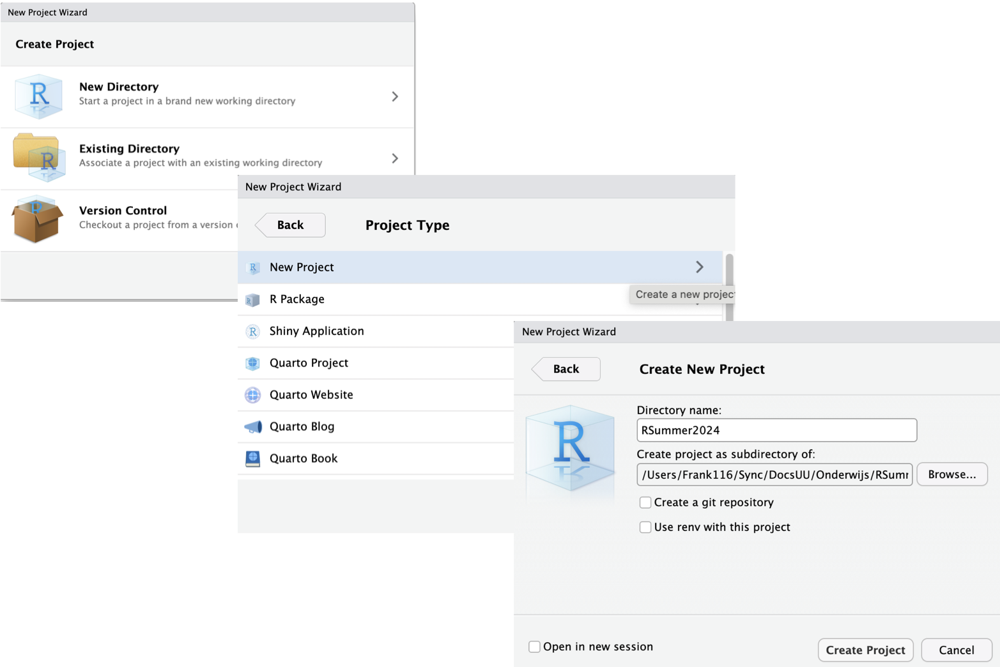
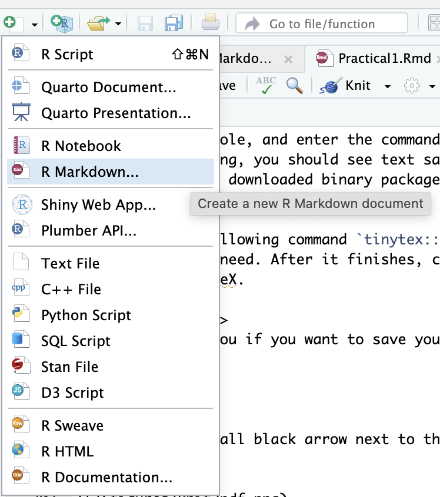
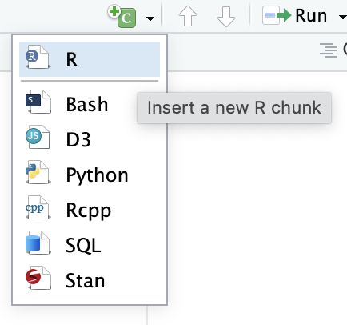
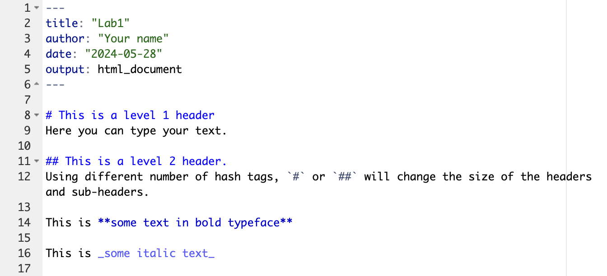
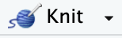
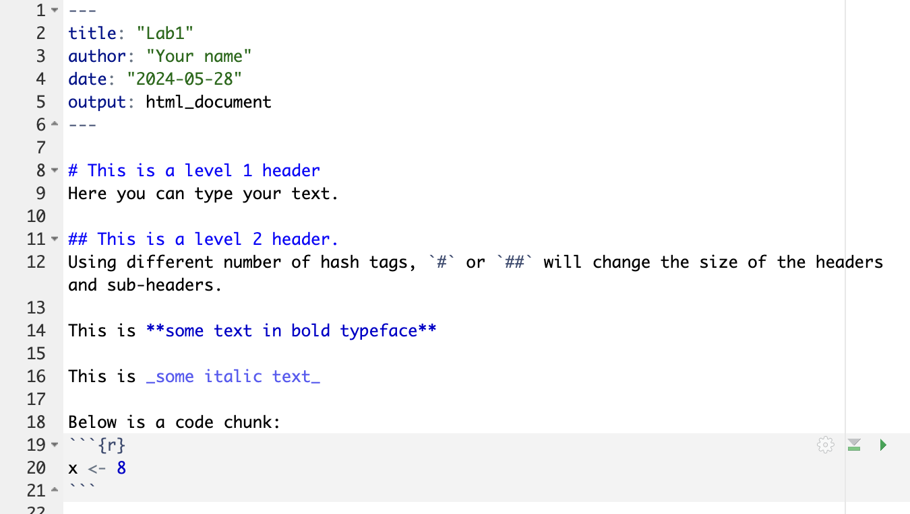
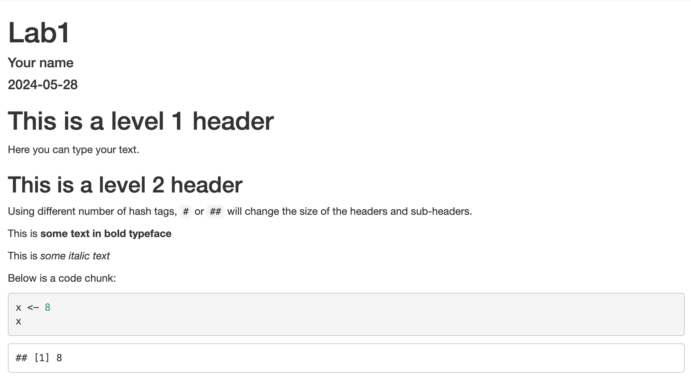

In this lab you will learn to work with R Markdown files and RStudio Projects.

## Exercise 1. Create an R Project to organise your work

In this course you learn to work with RStudio Projects. This way of working ensures that your R code and your analyses will continue to work and are easy to share with collaborators. 

1. Create a folder on your computer where you will store all the materials of this course. Call it for example "RSummer2024". It is better to avoid spaces in the name of your folder; you can use underscore (\_) or Capitals to separate words. 
2. Open RStudio. The RStudio interface will probably look like this:

{width="80%"}

3. Create a new RStudio Project by selecting File -> New Project. A new window pops up, choose the option "New Directory". Then create a folder "RSummer2024" in a directory of your choice. Click on "Create project". See the steps to create an R Project below. When you open a new RStudio Project, a new R session starts up and creates the project structure. 

{width="80%"}
<br>

**More information about RStudio Projects**

On the RStudio Support website you can find a webpage explaining all you need to know about RStudio Projects, see here: https://support.posit.co/hc/en-us/articles/200526207-Using-RStudio-Projects

## Exercise 2. Working with RStudio and R Markdown

### Open a new R Markdown file

To open a new file, click on the little green plus on the upper left part of the menu bar, and select R Markdown, as in the image below. In the window that pops up, leave the settings as they are. You do not have to fill in a title yet.

{width="40%"}

### The structure of an R Markdown file

Markdown is a simple formatting syntax for authoring HTML, PDF, and MS Word documents. A Markdown file has three components:

* On top of the document, a YAML part, which defines the markup of the document. YAML stands for "Yet Another Markup Language/ Ain't Markup Language".
* A text part, where you can create plain text. This part of the document is white.
* The code chunks, where you type R code (but you can also choose another programming language such as Python). Code chunks are grey coloured boxes.

### Open the Markdown Quick Reference

To learn more about R Markdown and to get help with the options, open the 
Markdown Quick Reference in RStudio, see menu Help -> Markdown Quick Reference. This will open the reference document in the output pane in the tab "Help". Use the Quick Reference to do the following exercise.

## Exercise 3. Try a few options in R Markdown

1.  When you open a new R Markdown file, it contains some example code. Delete all the code from line 8 downwards.
2.  The first line of the document shows the word "title". Change the title of the document in the YAML part of the document into: `title: 'Lab1a'`. Please note that you have to use quotation marks.
3.  Save the R Markdown file using File -> Save. Because you created an R Project in exercise 1, the R Markdown file will be saved automatically in the folder of the R Project.
4.  Fill in your name after "author: " in the second line of the document.
5.  Add a Level 1 Header called "This is a level 1 header" to the document. See Markdown Quick Reference, Headers, for how to make headers.
6.  Add a Level 2 sub-header with name "This is a level 2 header".
7.  Add a code chunk by selecting the green button with "c" on the top right, see screenshot below:

{width="30%"}

8. Write some plain text and mark some part of the text bold and some other part of the text italic. In the Markdown Quick Reference, you see that you can make text italic or bold using either `*` or `_`. Do you have an idea why there are two options for making text bold or italic? 
9. Save your R Markdown file.

After these steps, your R Markdown file should look like this:

{width="90%"}

## Exercise 4: Knitting your R Markdown file to HTML

Compile the R Markdown file as a HTML file. Click on the {width="10%"} icon and select "Knit to HTML" as the output format. Verify how the headers look like and whether some part of the text is indeed in italic or bold. 

Instead of knitting, it is also possible to get a preview by clicking on "Visual" in the left upper corner of the editor pane. Try both options.


## Exercise 5: Entering and running R commands

The **code chunks** are where you put R code in a R Markdown file. So far, your “knitted” file (your output document HTML file) does not show any results from R code, because we did not use any code chunks yet.

1. Add a code chunk by selecting the green button with "c" on the top right, see screenshot below:

{width="30%"}

When you create a new code chunk you should notice that the code area is grey and that it starts and ends with three back ticks \`.

One common mistake is to accidentally delete these back ticks. Remember, code chunks are grey and text entry is white - if the colour of certain parts of your Markdown does not look right, check that you have not deleted the back ticks.

2. Type the following command to create a new variable called `x` with the value of `8`, in this way: `x <- 8`.

The arrow `<-` is called an **assignment operator**, and tells R to save an object called x that has the value of 8. 

Even if `<-` is a pain to type, don’t use `=` instead, it will work, but it will cause confusion later. Use RStudio’s keyboard shortcut: `Alt/Option` + `-` (the minus sign). Notice that RStudio automatically surrounds `<-` with spaces (good code formatting practice).

Your R Markdown file should look like this now:

{width=70%}
**Running R commands**

To actually RUN this command, you have two options:

* Click on the green triangle in the code chunk. Note: this will run **all** the code in the code chunk.

* Highlight the code and hit Control-Enter on a PC or Command-Return on a Mac. This option allows you to run specific lines of code in a code chunk.

Think of “running” code in your console as telling R: “do this”.

3. Run the command using one of these two options. Note that you now have a new object in your workspace (top right pane), called `x`.

4. To look at the value of `x` (to get the value printed): add `x` in a new line of the code chunk, see below. Then run the code again. What happens?

```{r }
x <- 8
x 
```


5. Compile the R Markdown file again, using the Knit button and have a look at the result. It should look approximately like this:

{width=70%}

5. Remove the object `x` from the workspace by typing `rm(x)` in the code chunk and run this line.


## Exercise 6: Customizing chunk options 

You can customize the way your R code is displayed in the knitted html file. To do this for an individual code chunk, you have to add an option to the chunck header.

Some commonly used chunk header options are:

* Show both R code and output. This is the default R code chunk setting.
* Show the results, not the R code. Use `{r echo = FALSE}` in the code chunk header.
* Do not show the R code, do not show the results. Use `{r include = FALSE}`


**Question**

Add a new code chunk to your R Markdown file and type the code below in your code chunk. It creates a contour plot of the Maunga Whau volcano in New Zealand.  Try a few options to control the output of your code chunk, such as `{r echo = FALSE}` or `{r include = FALSE}` and see what happens when you knit the your R Markdown file. 

```{r contourplot }
image(volcano)
```

See the [R Markdown Cheat Sheet](https://posit.co/wp-content/uploads/2022/10/rmarkdown-1.pdf) for a complete list of knitr chunk options.


## Closing RStudio Projects

When you want to **close your RStudio Project**, there are several options:

* Quit RStudio using RStudio -> Quit RStudio. This will close the RStudio application but keep the current RStudio Project active. This means that when you open RStudio the next time, it will automatically open with the current RStudio Project. 

* Close the RStudio Project using File -> Close Project. This will only close the current RStudio Project, but it will not close the RStudio application.

Close the RStudio Project using the option where you close the RStudio Project, but keep the RStudio application open. A window will pop up asking you whether you want to save the workspace (this is the piece of memory where `x` with value 8 is located). Choose "do not save". 

For more information about RStudio Projects, see the [RStudio Support page.](https://support.posit.co/hc/en-us/articles/200526207-Using-RStudio-Projects)


### End of Lab 1a. 

If you have time left, play around with R and R-studio or do the advanced exercise.


## Advanced exercise: Inline code

1. Add a new code chunk to your document and type the following code but with your own information (name, age, country of residence, birthday). You can do this by copy the code below and paste it in the new code chunk. In the R language text values and dates need to be contained in quotation marks but numerical values do not. 


```{r}
name <- "Karin" 
age <- 26
country <- "The Netherlands"
today <- Sys.Date()
birthday <- as.Date("2024-10-11")
```

2. A Markdown file is convenient for combining code and text in the same document. When reporting the results of statistical analyses, you will need to refer to the statistics from your analyses. This can be done in R Markdown using inline code. Let’s use the information from your code chunk to demonstrate how inline code works. Copy and paste this text exactly (do not change anything) to **the white space** underneath your code chunk (not in the code chunk!):

```{r eval=FALSE}
My name is `r name` and I am `r age` years old. It is `r birthday - today` days until my birthday.
```

3. Knit the document using Knit -> Knit to HTML and look at the result. It should look like this, but then with your own name, country etc.: **My name is `r name` and I am `r age` years old. It is `r birthday - today` days until my birthday.**


**End of the advanced exercise.**

