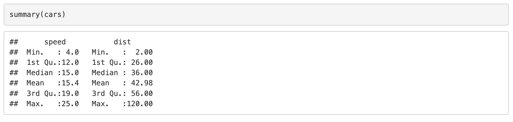

```{r include=F}
knitr::opts_chunk$set(comment="")
```

## Topics of this lecture

1. Introduction to R and RStudio
   + Working with packages
   + Getting help in R
   
2. Reproducible data analysis with R Markdown

3. Organise your work with R Projects   


# Introduction to R and RStudio


## What is R

* R is a language and environment for statistical computing and for graphics
* Based on the object-oriented language S (1975)
* 100% free software
* Managed by the R Foundation for Statistical Computing, Vienna, Austria.
* Community-driven:
  + More than 10.000 packages developed by community
  + New packages are constantly being developed
  + New features are constantly being added to existing packages


## Fun fact about R:

Every version of `R` that is released is named after a topic in a Peanuts comic. The `R` version 4.3.3 (2024-02-29) is called "Angel Food Cake".

R version  | Charlie Brown cartoon
---------- | ----------
{width=80%} | {width=70%}

## What is RStudio?

* RStudio is an Integrated Development Environment (IDE)
* RStudio has all functionality in one place and makes working with R much easier.
* Use RStudio to:
  + Edit scripts, Run scripts
  + Manage your code with highlighting
  + Navigate files, organize projects
  + Utilize version control (e.g. Github)
  + View static and interactive graphics
  + Create different file types (RMarkdown, Shiny apps)
  + Work with different languages (Python, JavaScript, C++, etc.)


## The 4 panes in RStudio 

{width=90%}

# Demo RStudio

# Working with R packages

## R Packages: base installation

* When you start RStudio and R only the base packages are activated: the basic installation with basic functionality.

* There are almost 20.000 packages that have been developed by R users all over the world. See the [Comprehensive R Archive Network (CRAN)](https://cran.r-project.org/web/packages/)

* Not efficient to have all these packages installed every time you use R. Install only the packages you want to use.

## See which packages are active

* Use `sessionInfo()` to see which packages are active. 

* This is how the basic installation looks like:

{width="60%}


## Overview of installed packages

An overview of the packages you have installed, see the tab “Packages” in the output pane:

{width=70%}


## How to work with packages

Packages are like apps on your mobile phone.

* When you want to use a package for the first time, you have to **install** the package.

* Each time you want to use the package, you have to **load** (activate) it.


## Opening and closing packages 

To **load** a package use the following code (similar to opening an app on your phone):

```{r eval=FALSE}
library(ggplot2)
```

To close a package use (similar to closing an app on your phone): 
```{r eval=FALSE}
detach(ggplot2)
```


# Reproducible data analysis with R Markdown

## Why work with R Markdown?

The need to *combine code and text* and to document all the steps to make __reproducible__ (scientific) reports of data analyses.

<br>


<br>

To __collaborate__ effectively and use __version control__ with Github.


[_Images source_](https://zsmith27.github.io/rmarkdown_crash-course/introduction.html)


## Why work with R Markdown?

It is __efficient__. Generate and update reports in all kinds of formats:

{width=80%}

[_Source:_ What is R Markdown? Video RStudio](https://vimeo.com/178485416) 


# Demo R Markdown


## Writing text in R Markdown

See the [R Markdown Cheat Sheet](https://posit.co/wp-content/uploads/2022/10/rmarkdown-1.pdf) for a complete list of options.

{width=70%}

## Writing text in R Markdown


{width=80%}
{width=80%}

## Writing code in R Markdown

Code chunks start with `{r }` (for R code). You can give code chunks names (here cars).

{width=90%}
This is how the result looks like in the rendered html document. Display of both R code and results:

{width=100%}

## Code chunk options

You can choose to hide the R code with `echo=FALSE` in the chunk header:

{width=90%}

{width=40%}
See the [R Markdown Cheat Sheet](https://posit.co/wp-content/uploads/2022/10/rmarkdown-1.pdf) for a complete list of knitr chunk options.

## Getting help with R Markdown

R Markdown Cheat Sheet: 

{width=60%}


# R Studio Projects

## Use RStudio Projects

Every time you start a new (data analysis) project, make it a habit to create a new __RStudio Project__.

**Because you want your project to work:**

-   not only now, but also in a few years;
-   when the folder and file paths have changed;
-   when collaborators want to run your code on their computer.

<br>

__RStudio Projects__ create a convention that guarantees that the project
can be moved around on your computer or onto other computers and will
still "just work". It creates relative paths (no more broken paths!).


## Example: Data analysis RStudio project

All data, scripts, and output should be stored within the project directory.

Every time you want to work on this project: open the project by
clicking the `.Rproj` file.

<center></center>

# Lab 1a

## Lab 1a: learn to work with R Projects and R Markdown

* Open the course manual
* Click on the tab "Monday"
* Go to __Course material__ and click on **Lecture + Lab 1a**, which starts the download of a folder with:
  + A html file of the lecture: "1a RStudio Rmarkdown.html"
  + A html file of the lab: "1a Lab.html"

{width=70%}
