```{r echo=FALSE}
knitr::opts_chunk$set(comment="")
```


## Topics of this lecture

1. Functions and arguments
    + The structure of functions
    + Using R functions: arguments
    + Help file

2. Getting help in R
    + When you know the name of the package / function
    + When you do not know the name of the package / function


# Functions

## Functions in R

* Functions are the building blocks of R

* Built-in or user-defined (program your own functions).

* To use a function, type the function name with parentheses: `mean()`

* Typing the name of the function without the parentheses reveals the R code of the function: **`sample()`**:

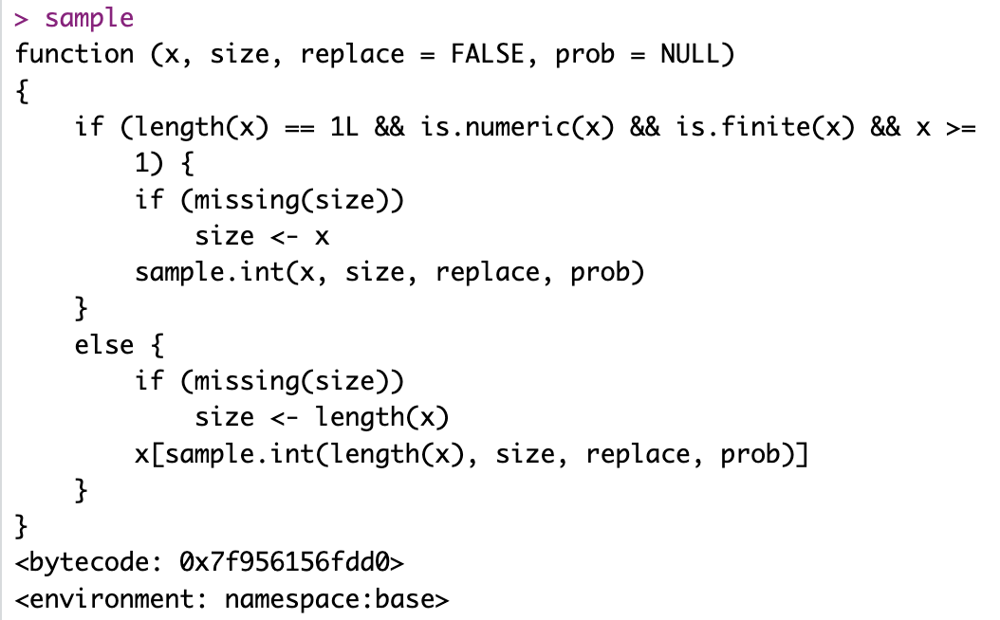{width=50%}


## The structure of functions in R

Every function in R has the following structure:

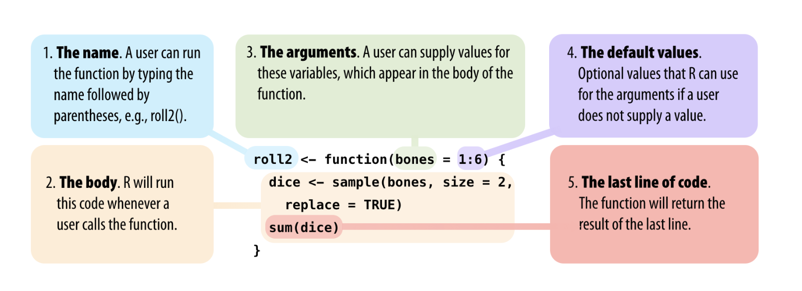

<sup>
[Image source: Garrett Grolemund, Hands-On Programming with R, 2.6](https://rstudio-education.github.io/hopr/basics.html#functions)
</sup>


## Function arguments

To use a function in R, you need to know the **required input information = arguments**.

For example the function `sample()`

Use `args(<function name>)` to obtain info about the arguments and the default values: 

```{r}
args(sample)
```

## Information about arguments

Or make use of the pop-up help and use the TAB key to cycle through the arguments:


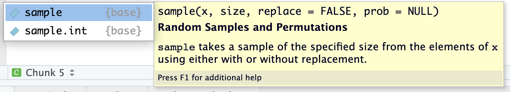{width=70%}

Clicking `F1` opens the help file of the function `sample()`:

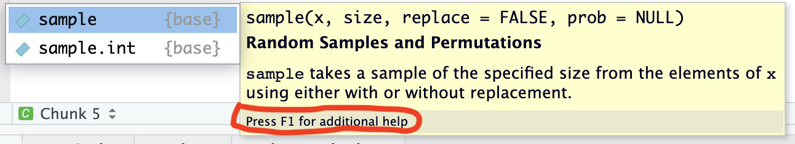{width=70%}


## Using R functions: help file

Clicking `F1` opens the help file of the function `sample()`:


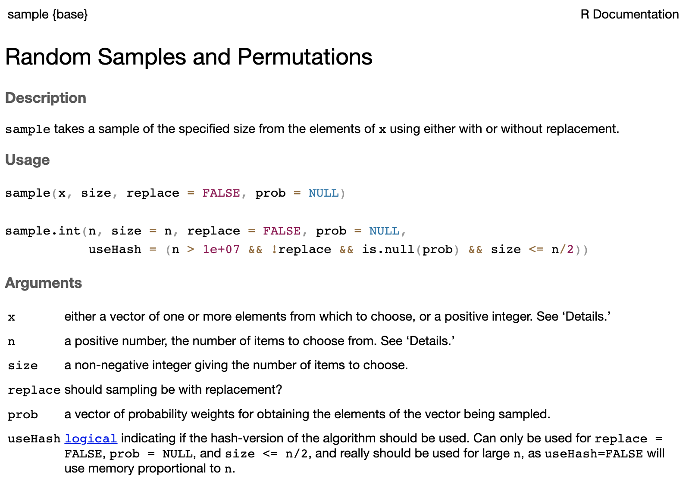{width=70%}


## Using R funtions: arguments

Now we can use the `sample()` function to, for example, mimic the sampling of two dice.

```{r}
dice <- sample(x=1:6, size=2, replace=TRUE)
dice
```

`x` represents the items to sample from the range of possible items: the numbers 1 to 6 (the eyes of a single die).

`size` is the number of items to choose, in this case 2

`replace=TRUE` means sampling with replacement (throwing double 4 is allowed)

**Recommendation: type out the arguments and their values. This prevents errors and increases the readability of your code.**


# Working with packages and functions: common errors

## Loading a package that is not installed

For example, we want to load the package `bayesforecast` but it is not installed. 

<br>

In the console, we will get the following **Error**:

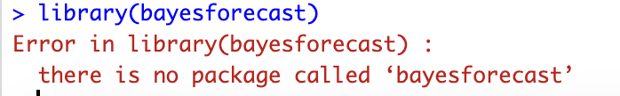{width=50%}

<br>

In the RMarkdown file you get an error as well and knitting is stopped:

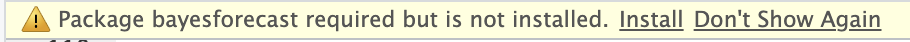{width=70%}

## Calling function/data but package is not loaded


Calling the data set "gapminder" when the package `gapminder` is not loaded will produce an error and the code will not run:

```{r eval=F}
data(gapminder)
```

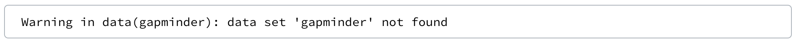{width=120%}

<br>


**Note:** the error message does not mention that the package is not loaded. 

<br>

Solution:

```{r eval=F}
library(gapminder)
data(gapminder)
```


## Same function name, different package

Functions `filter()` and `lag()` occur in both packages `dplyr` and `stats` (basic installation).

Loading the package `tidyverse` will cause the `filter()` and `lag()` functions to overwrite the `filter()` and `lag()` functions of the `stats` package. See below: "Conflicts"

Solution? Use **namespaces `::`** to indicate which function you want to use:

* **`dplyr::filter()`**
* **`stats::filter()`**

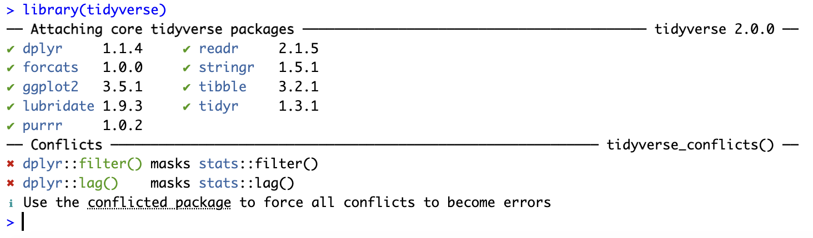{width=90%}


# Getting help in R

## Getting help when you know the function or package

Every package and function in `R` has a help file. 

You can ask for help in the search bar of the output pane.

See below an example of searching help for "plot":

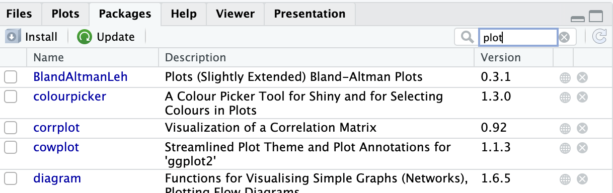{width=70%}


## Getting help when you know the function or package

You can also *ask for help in the console:*

* For a function: type: `help(sample)` or `?sample` (opens a help window).

* For a package type: `help(package=ggplot2)`.

* When you start typing `sample` in the console or editor (Markdown code chunk) a pop-up window appears with help about the structure of the function.

{width=80%}

## Getting help when you know the function or package

Some packages have **cheat sheets**, see in `R Studio`, `Help menu -> Cheat Sheets`

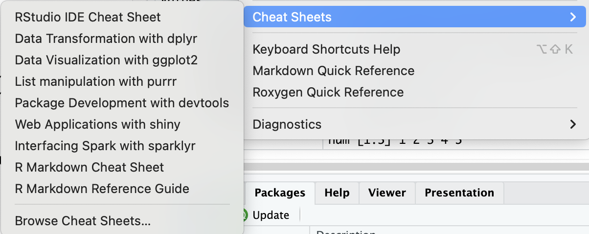{width=80%}

## RStudio IDE Cheat Sheet

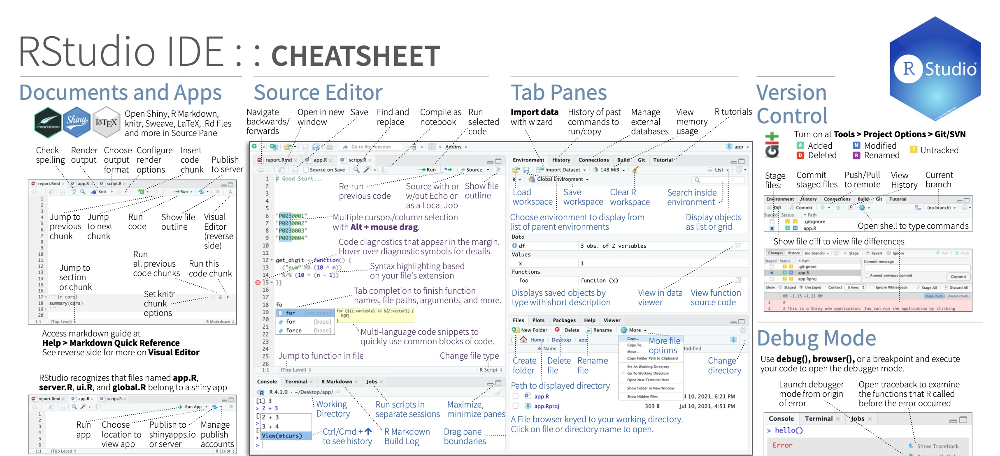

## Getting help when you do not know the function or package

* Type your search term in the search bar of the output pane:

{width=70%}


## Getting help when you do not know the function or package

* In the console:
    + Type `??` followed by your search term.
    + For example `??anova` returns a list of all help pages that contain the word ‘anova’.

* Google the search term(s) and add ‘R’ as keyword.

* Helpful websites: <http://www.stackoverflow.com> and <http://www.stackexchange.com>


## Some tips for coding:

-   Keep your code tidy
-   Use comments (text preceded by `#`) to clarify what you are doing
    -   If you look at your code again, one month from now: you will not know what you did --\> unless you use comments
-   When working with functions, use the TAB key to quickly access the help for the function's components
-   Work with logically named `R`-files
    -   indicate the sequential nature of your work (Figure_1, Figure_2)
-   Work with `RStudio` projects and a logical folder structure (data, results, figures)


# Lab 1b

## Lab 1b

* Go to the Course manual and select the tab "Monday".
* Under "Course Material", click **Lecture + Lab 1b** and this will cause a zip/tar file to download.
* Unzip the file and you will get 3 files:
  + **1a R Basics**: a html file of the lecture 1b. R Basics.
  + **1b Lab.html**: a html file with the lab exercises. 
  + **1b Lab template**: an R Markdown file where you can fill in your answers. 
* Save the files in your R Project folder.


**Solution**

The file "1b Lab.html" provides help about the code: the code of the answers is given but hidden by default. If you want to see the code, click on the "SHOW" button in the right margin. 


