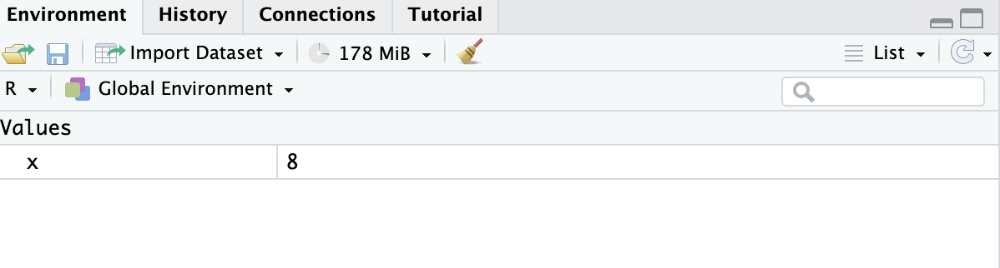

```{r setup, echo=FALSE, message=FALSE, error=FALSE}

knitr::opts_chunk$set(comment="")

set.seed(123)

# Ensures the package "pacman" is installed
if (!require("pacman")) install.packages("pacman")

pacman::p_load(tidyverse,
               ggplot2,
               kableExtra)
```

## Topics

1.  R data objects
    -   vectors
    -   matrices
    -   data frames
    -   lists
    -   factors
    -   model formula
2.  Naming conventions, style guide

# R data objects

## Using R as a calculator

The simplest thing you could do with R is do arithmetic:

```{r collapse=T}
100 + 10
```

```{r collapse=T}
9 / 3
```

## Using R as a calculator

Here are the common signs to use in arithmetic:

| arithmetic     | sign        |
|----------------|-------------|
| Addition       | `+`         |
| Subtraction    | `-`         |
| Multiplication | \*          |
| Division       | `/`         |
| Exponents.     | `^` or \*\* |

## Assignment operator

In the lab you have learned about the `<-` **assignment operator**.

Here `x` is assigned the value `8`

```{r}
x <- 8 
```

If you run this code:

-   a new value will be saved in your work space (piece of memory)
-   In the environment pane, the tab "Environment", you will see `x` under "Values" followed by 8

{width="80%"}

## Printing values

```{r}
x <- 8 
```

Assigning does not print the value 8.

If you want to print to value 8 you can do:

```{r eval=FALSE}
x 

# or:

print(x)
```

## R is an object-oriented programming language

When you assign values with the assignment operator `<-` you create an R **object**.

Objects can contain data, functions or even other objects.

The most commonly used objects are:

-   vector
-   matrix
-   data frame
-   list
-   formulas and models

# Vectors

## Vector

A vector is a list of values (data). The simplest object in R is a vector with one element:

```{r}
x <- 8 
```

## Vector generating functions

The function `c(...)` collects elements in a vector

```{r collapse=T}
v <- c(1, 2, 3, 4, 5)
```

-   `seq(from, to)` or `:` generate a sequence of integers

::: columns-2
```{r}
seq(from = 1, to = 5)
```

```{r}
1:5
```
:::

-   `rep(..., times)` repeats `...` a number of `times`

```{r collapse=T}
rep(1:5, times = 2)
```

## Classes

Vectors (and othe R objects) can contain different data types (classes)

**Numeric**

```{r collapse=T}
(v <- c(1, 2, 3, 4, 5))
class(v)
```

## Classes

**Character**

```{r collapse=T}
(char <- c("cat", "dog"))
typeof(char)
```

## Classes

**Logical** data can take only one of two values: `TRUE` or `FALSE`.

```{r collapse=T}
(v <- c(1,2,3,4,5))

# Identify elements > 3 in numeric vector v:
logical <- v > 3

print(logical)
```

## Vector classes

-   all elements of a vector (are forced to) have the same class

```{r collapse=T}
class(num <- c(1, 2))

class(char <- c("cat", "dog"))

c(num, char)

class(c(num, char))
```

# Matrices

## Matrix generating functions

-   `matrix(data, nrow, ncol)` generates a matrix
    -   all elements (are forced to) have the same class

```{r collapse=T}
M <- matrix(data = 1:6, nrow = 2, ncol = 3)
M
class(M)
```

::: columns-2
`cbind(...)` collects vectors in a matrix as columns:
```{r collapse=T}
cbind(a = 1:2, b = c("cat", "dog"))

```

`rbind(...)` collects vectors as rows:
```{r collapse=T}
rbind(a = 1:2, b = c("cat", "dog"))
```
:::

# Data frames

## Data frame generating functions

-   `data.frame(...)` collects vectors as variables in a data frame
    -   variables can have different classes

```{r collapse=T}
df <- data.frame(x = 1:2, y = c("cat", "dog"), z = c(T, F))
df
class(df)

sapply(df, class)
```

# Lists

## List generating function

-   `list(...)` creates a list

    -   can contain objects of any dimension and class
    -   used for collecting output from R function (e.g. linear regression)

```{r collapse = T}
L <- list(v = c(1, 2), matrix = M, df = df, list(1:10))
class(L)
sapply(L, class)
```

# Factors

## Factors

-   `factor(...)` makes / changes vector into factor

    -   factors have levels
    -   used for categorical variables in analyses (e.g. linear model)

```{r collapse=T}
animals <- rep(c("cat", "dog"), 4)
summary(animals)

factor(animals)
summary(factor(animals))
```

## Assign names with `names()`

Use `names()` to assign names to elements in R objects.

For example to the elements of a list:

```{r}
names(L) <-c("Vector", "Matrix", "Dataframe", "List")
L
```

## Formulas and models

We use the `~` (tilde) operator to construct an **R model formula**, a type of **language object**.

Example: model body mass index (BMI) on weight with a linear regression model.

Use the model formula `bmi ~ wgt` with the linear model function `lm()`:

```{r message=FALSE, warning=FALSE}
require(mice)
lm(formula = bmi ~ wgt, data = boys)
```

In this case, `bmi` \~ `wgt` means: "regress `bmi` on `weight`".

## The model formula for plots

The model formula can also be used to create a scatter plot. Using the formula object `bmi ~ wgt`, leads automatically to the choice of scatter plot with `bmi` on the y-axis and `wgt` on the x-axis.

```{r message=FALSE, warning=FALSE}
plot(formula = bmi ~ wgt, data = boys)
```

## Use of data objects

When to use the R data objects?

| Object           | Use                       | Why                                                                   |
|--------------------|------------------------|----------------------------|
| data frame       | statistical analysis      | can store variables of any class                                      |
| model formula    | statistical models, plots | concise and readable, flexible, consistent across functions, packages |
| lists            | storage of output         | can store any object of any class                                     |
| vectors/matrices | programming               | can do fast calculations                                              |

# Naming conventions, style guide

## File and object naming

-   File names should be **meaningful**.
-   **Avoid spaces in file names** and use one of the **naming conventions**:

1.  **snake_case**: words are separated by underscores (\_), and all letters are typically in lowercase. Examples: data_analysis.RData, my_data.csv.

2.  **camelCase:**: each word within a compound word is capitalized, except for the first word, and no spaces or underscores are used to separate the words. Examples: calculateMean, summaryStatistics.

3.  **PascalCase**: the first letter of each word in a compound word is capitalized, and no spaces or underscores are used to separate the words. Examples: DataAnalysis, DescriptiveStatistics.

## Spacing and indentation

-   When indenting your code, use 2 spaces. `RStudio` does this for you!
-   Never use tabs or a mix of tabs and spaces.
-   Place spaces around all operators (`=, +, -, <-`). Use `x <- 5` not `x<-5`

<br>

Exception: spaces around = are optional when passing parameters in a function call.

```{r eval=FALSE}
lm(age ~ bmi, data=boys)
```

or

```{r eval=FALSE}
lm(age ~ bmi, data = boys)
```

## Commas and punctuation

-   Do not put spaces before commas, but always put a space after commas.
    -   `c(1, 2, 3)`
-   For function arguments, follow the same rule.
    -   `sum(a = 1, b = 2)`

<br>

Bad examples:

```{r eval=FALSE}
# No spaces around debug
if ( debug )  
  
# Needs a space after the comma   
x[1,]  
```

## Comments

-   Use \# for single-line comments and place them above the code they reference.
-   Keep comments concise and relevant.

```{r eval=F}
# Read the msleep.csv data and save the data as msleep
msleep <- readr::read_csv("msleep.csv")
```

# Lab

## Lab 1c

-   Download the files of Lecture and Lab 1c.
-   Save the files in your RSummer2024 project folder and maintain a logical structure, for example like this:

{width="40%"}
