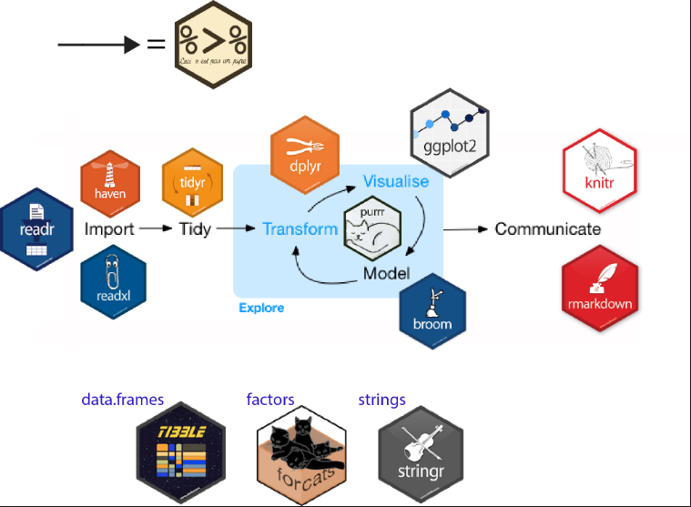
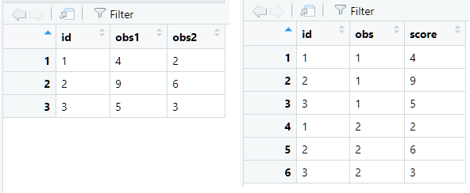
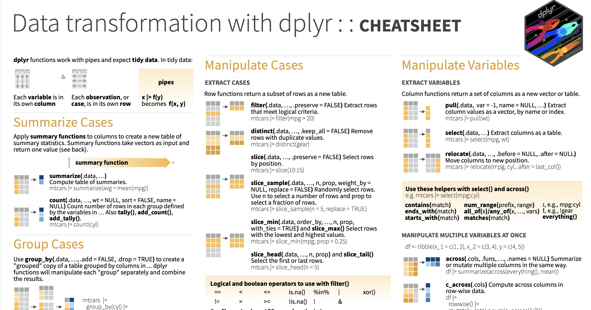

```{r include=FALSE}
knitr::opts_chunk$set(message = FALSE, comment = "")

```


```{r echo=F}
# Ensures the package "pacman" is installed
if (!require("pacman")) install.packages("pacman")

pacman::p_load(tidyverse,
               ggplot2
               )
```


```{r prepare data, echo=F}
planet     <- c("Mercury", "Venus", "Earth", "Mars", 
                "Jupiter", "Saturn", "Uranus", "Neptune")

planet_type     <- c("Terrestrial planet", "Terrestrial planet", 
              "Terrestrial planet", "Terrestrial planet", "Gas giant", 
              "Gas giant", "Gas giant", "Gas giant")

diameter <- c(0.382, 0.949, 1, 0.532, 11.209, 9.449, 4.007, 3.883)

rotation <- c(58.64, -243.02, 1, 1.03, 0.41, 0.43, -0.72, 0.67)

rings    <- c(FALSE, FALSE, FALSE, FALSE, TRUE, TRUE, TRUE, TRUE)

planets <- data.frame(planet_type = factor(planet_type), diameter, rotation, rings, row.names = planet)
```


## Topics of this lecture

The `tidyverse` packages 

* `dplyr` package
* pipe operator `%>%`
* standard solves for missing data

Importing data


# The tidyverse packages


## `tidyverse` and the data analysis cycle

{width=70%}

## Tidyverse and the verbs of data manipulation

Leading principle: language of programming should really behave like a language, tidy**verse**.

<br>

tidyverse: a few key **verb** that perform common types of data manipulation.


## Tidy data

The `tiyverse` packages operate on *tidy* data:

1. Each column is a __variable__

2. Each row is an __observation__

3. Each cell is a single __value__

<br>

```{r echo=FALSE, fig.align="center", out.width="70%", fig.cap="Untidy versus tidy data"}

```

# The `dplyr` package

## Data manipulation with `dplyr`

The *dplyr* package is a specialized package for working with `data.frames` (and the related `tibble`) to transform and summarize tabular data:

* summary statistics for grouped data
* selecting variables
* filtering cases
* (re)arranging cases
* computing new variables
* recoding variables


## `dplyr` cheatsheet



## Why `dplyr`?

* Targeted for data analysis with data frames (tibbles)
* More intuitive and easier than base R functions
* No need for working with square brackets

<br> 

In combination with the pipe operator `%>%`:

* performs a series of operations step-by-step
* no need to write code inside-out
* no need to make intermediate objects 

## `dplyr` functions in this lecture

There are many functions available in dplyr, but we will focus on just the following `dplyr` functions (verbs):

| dplyr verbs   | Description           |
| --------------| ----------------------|
| `glimpse()`   | a transposed print of the data that shows all variables |
| `select()`    | selects variables (columns) based on their names |
| `filter()`    | subsets the rows of a data frame based on their values |
| `arrange()`   | re-order or arrange rows |
| `mutate()`    | adds new variables, or new variables that are functions of existing variables |
| `summarise()` | creates a new data frame with statistics of the variables (optional grouped by another variables) |
| `group_by()` | allows for group operations in the "split-apply-combine" concept |

Check the [`dplyr` cheat sheet](https://rstudio.github.io/cheatsheets/data-transformation.pdf) for examples.

## `dplyr::glimpse()`

* Prints a transposed version of the data: variables are the rows, observations are the columns.
* Makes it possible to see every column in a data frame.
* It is similar to `str()`, but shows more data.
* `str()` shows more detailed information about data structure.

```{r , echo=T, collapse=T}
dplyr::glimpse(planets)
str(planets)
```

## Select columns with `dplyr::select()`

Select variables `type` and `diameter` from the planets data frame:

```{r }

dplyr::select(planets, planet_type, diameter)

```

## Select columns with `dplyr::select()`

Select numerical variables with `where(is.numeric)`:

```{r}
dplyr::select(planets, where(is.numeric))
```

## Select rows with `dplyr::filter()`

Selects subsets of the rows of a data frame based on their values.

Select the planets that have a ring and that are gas giants:

```{r}
dplyr::filter(planets, rings == TRUE, planet_type == "Gas giant")
```

## The pipe operator %>%

Shortcut key: `Ctrl/Cmd + Shift + M` 

{width=25%}


## How `%>%` works

Passes (transformed) data on to the next operation

* avoids nested code

* avoids creation of intermediate objects
  

<br>

Basic principle of `%>%` operator

```{r  eval=FALSE}
data %>% 
  
  perform operation A and pass on transformed data %>% 
  
  perform operation B and pass on transformed data %>% 
  
  etc.
```


## `dplyr::select()` with the pipe operator

<div class="columns-2">
`dplyr::select` **without `%>%`**
```{r}
dplyr::select(planets, planet_type, diameter)
```
Straightforward and might be more familiar to those used to base R functions.

`dplyr::select` **with `%>%`**
```{r}
planets %>%
  dplyr::select(planet_type, diameter)
```
More readable and flexible when chaining multiple `dplyr` functions.
</div>


## Compute new variables with `dplyr::mutate()`

`dplyr::mutate()` adds a new variable to the data frame.

```{r include=T, echo=T, eval=F}
data %>% 
  dplyr::mutate(..., .keep = c("all", ...), .before = NULL, .after = NULL)
```

<br>

*Arguments:*

`.keep` specifies which variables to return, "all", "used", "unused", "none".

`.before` or `.after` determine where the new variables are inserted.


## Compute new variables with `dplyr::mutate()`

```{r include=T, echo=T, eval=F}
data %>% 
  dplyr::mutate(..., .keep = c("all", ...), .before = NULL, .after = NULL)
```

<br>

**Example**: compute a new variable `rotation_diameter = rotation/diameter`, add it to the data frame and keep all other variables:

```{r}
planets %>% 
  dplyr::mutate(rotation_diameter = rotation/diameter, .keep = "all") %>%
  glimpse()
```

## Temporary / permanent changes

The pipe operations do not make changes to the original data set, unless you save the results:

**Temporary:**
```{r eval=FALSE}
planets %>% 
  dplyr::mutate(rotation_diameter = 
                  rotation/diameter)

```

```{r}
names(planets)
```

**Changes saved in new data frame:**
```{r collapse=T}
new_data_set <- planets %>% 
  dplyr::mutate(rotation_diameter = 
                  rotation/diameter) 
names(new_data_set)
```


## Re-order rows with `dplyr::arrange()` 

Order the rows of the `planets` data set on ascending values of `diameter`:

<br>

<div class="columns-2">

Original data set:
```{r}
planets
```

Ordered data set, based on diameter:
```{r }
planets %>% 
  dplyr::arrange(diameter)
```
</div>


## Multiple transformations: base R and `dplyr`

Suppose we want to perform the following transformations:

1. Sort the rows of `planets` on ascending values of `rotation`
2. Select only planets with diameter `> 1`
3. Display the variables `planet_type`, `diameter` and `rotation`

<div class="columns-2">
**With base R code:**
```{r}
subset(planets[order(planets$rotation), ],  
       subset = diameter > 1, 
       select = c(planet_type, diameter, 
                  rotation))
```

**With `dplyr` and the pipe `%>%` operator**
```{r}
planets %>% 
  dplyr::filter(diameter > 1) %>% 
  dplyr::arrange(rotation) %>% 
  dplyr::select(planet_type, diameter, rotation)
```
</div>


## Summary statistics with `summarise()`

The `dplyr` function for summarizing data:

```{r}
planets %>% 
  dplyr::summarise(
    mean_diameter = mean(diameter), 
    sd_diameter = sd(diameter)
  )
```

* Various summary function(s):
  + `mean()`, `median()`, `sd()`, `var()`, `sum()`, for numeric variables
  + `n()`, `n_distinct()` for counts
  + many others, see: `?dplyr::select` and [cheat sheet](https://rstudio.github.io/cheatsheets/data-transformation.pdf))


## Summaries for groups with `group_by()`

The `dplyr` function for grouping rows of a data frame is very useful in combination with `summarise()`

Example: group the planets based on having rings (or not) and compute the mean and the standard deviation for each group.

```{r}
planets %>% 
  dplyr::group_by(rings) %>%
  dplyr::summarise(
    mean_diameter = mean(diameter), 
    sd_diameter = sd(diameter)
  )
```

## Pipes and the R model formula `~`

Sometimes the data we want to use, are "piped" in the wrong argument, see e.g.:
```{r eval=FALSE}
planets %>% 
  lm(diameter ~ rotation)
```
This leads to an error:

<font color="grey">Error in as.data.frame.default(data) : 

  cannot coerce class ‘"formula"’ to a data.frame</font>

The `%>%` pipe operator works with functions where the **first** argument of the next function in the pipeline is a data frame. 

For the function `lm()` the first argument is the model formula (a text object):

`lm(x ~ y, data = dataframe)`


## Solution: use placeholder `.`

We can use the `.` symbol to act as placeholder for the data:
```{r}
planets %>% 
  lm(diameter ~ rotation, data = .)
```


# Standard solves for missing values

## Dealing with missing values in `R`

Calculations based on missing values (NA's) are not possible in `R`:
```{r , collapse=T, echo=T}
variable <- c(1, 2, NA, 4, 5)
mean(variable)
```

There are two easy ways to perform "listwise deletion":
```{r collapse=T, echo=T}
mean(variable, na.rm = TRUE)
mean(na.omit(variable))
```

## Dealing with missing values with `dplyr`

```{r echo=F}
score <- c(1, 2, NA, 4, 5)
df <- data.frame(score)
```

```{r collapse=T}
df$score
```

<div class="columns-2">
No solution for missing values:
```{r}
df %>% 
  dplyr::summarise(
    mean_variable = mean(score), 
    sd_variable = sd(score)
  )
```
Use `na.rm = TRUE`:
```{r}
df %>% 
  dplyr::summarise(
    mean_variable = mean(score, na.rm = TRUE), 
    sd_variable = sd(score, na.rm = TRUE)
  )
```
</div>

## Style guide for coding pipes

Code with a single pipe operator on one line and spaces around `%>%`:

```{r include=T, echo=T, eval=F}
data %>% dplyr::select(X)
```

Code with multiple pipe operators on multiple lines:

```{r include=T, echo=T, eval=F}
data %>% 
  dplyr::group_by(X) %>% 
  dplyr::filter(Y > 4) %>% 
  dplyr::summarise(mean(Y))
```

but definitely NOT:

```{r include=T, echo=T, eval=F}
data%>%dplyr::group_by(X)%>%dplyr::filter(Y>4)%>%dplyr::summarise(mean(Y))
```

## More about coding style: `tidyverse` style guide

https://style.tidyverse.org/index.html


# Importing data into `R`

## R data format and workspace: `.RData`

The `R`  data file format is `.RData`.

In RStudio your data and the alterations on the data, are saved in the workspace.

* A workspace contains all changes you made to your data and functions during a session. 
* Workspaces are compressed and require relatively little memory when stored. The compression is very efficient and beats reloading large data sets from raw text.

You can save a data frame saved in your workspace with:

```{r eval=FALSE}
save(name_data_frame, "name_file.RData")
```

To open the data use:
```{r eval=FALSE}
load("name_file.Rdata")
```

Note: This code works if you have placed the .RData file in the same project folder as your Rmd file. You do not have to specify a file path. 

## Data sets in R (packages)

R has many in-built data sets. The command `data()` will give a list of all in-built data sets (also the data included in the non-base packages that are activated). 

Open an in-built data set as follows:
```{r eval=F}
require(MASS) # load the package MASS that contains the mammals data.
data(mammals) # load the mammals data
```

## Importing delimited data files

Text files (.txt) can be imported in to R with:
```{r eval=FALSE}
read.table("mammalsleep.txt")
```

CSV (comma seperated values) files can be imported with the `readr` package from `tidyverse`:

```{r eval=FALSE}
read_csv("filename.csv")
```


## Read and write statistical data formats

There are many packages that facilitate importing/exporting other data formats from statistical software: 

* SPSS: the function `read_spss` from package `haven` (but also other data formats from Stata and SAS)
* Mplus: package `MplusAutomation`
* Stata: `read.dta()` in `foreign`
* SAS: `sasxport.get()` from package `Hmisc` 
* MS Excel: 
    + function `read.xlsx()` from package `openxlsx`
    + function `read_excel()` from package `readxl`

[`haven`](https://haven.tidyverse.org/index.html) by [Hadley Wickham](http://hadley.nz) provides wonderful functions to import and export many data types from software such as Stata, SAS and SPSS. 

For a short guideline to import multiple formats into `R`, see e.g. http://www.statmethods.net/input/importingdata.html. 


# Lab

## Lab 2a

* Download the files Lecture and Lab 2a
 


