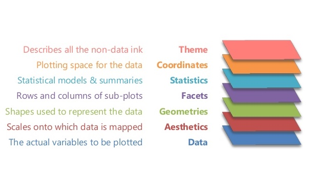

```{r, message=FALSE, warning=FALSE, include=F}
library(MASS)     # Datasets
library(mice)     # Boys dataset
library(dplyr)    # Data manipulation
library(magrittr) # Pipes
library(ggplot2)  # Plotting suite
library(patchwork)
boys <- na.omit(boys)
knitr::opts_chunk$set(message=F)
```

## Why data visualization?

Process a lot of information quickly

- distributions, relationships, outliers

- summary statistics, correlations, e.g. do not tell the whole story

$~$

</img>


## Base R versus `ggplot2`

Different philosophies

- base R plots

    - one type of plot (e.g. scatter, box, histogram)
    
    - plot arguments for appearance (e.g. labels, colors, sizes, etc.)
    
    - add things later (e.g. points, lines) with low-level plot functions
    
- `ggplot`

    - add layers to a plot
    
    - change appearance of the plot in any of these layers
    
        - e.g. add points, lines, change labels, shapes, orientation, multiples, etc.

# Base R plots

## High- vs low-level plot functions

High-level plot functions create a plot (... are additional arguments)

```{r eval = FALSE}
plot(x, y = NULL, ...)

hist(x, ...)   

boxplot(formula, data, ...) 

barplot(formula, data, ...)     
```

Low-level plot functions add something to the plot

```{r eval = FALSE}
points(x, y)  

lines(x, y)   

abline(a, b, h, v)   

text(x, y, labels)      

legend(x, y, legend)      
```


## High-level plot functions

```{r fig.width = 6, fig.height = 4}
par(mfrow = c(2, 3))
with(mtcars, plot(mpg))                    # or plot(mtcars$mpg)
with(mtcars, boxplot(mpg))
with(mtcars, plot(factor(gear)))
with(mtcars, plot(disp, mpg))
with(mtcars, boxplot(mpg ~ gear))
with(mtcars, barplot(xtabs(~ gear + cyl))) # no legend!
```


## Low-level plot functions

```{r}
with(mtcars, plot(disp, mpg, col = c("red", "blue")[am + 1]))   # add colors 
legend("topright", legend = c("automatic", "manual"),           # add legend
       col = c("red", "blue"), pch = 1, title =  "transmission")      
```


# ggplot2

## What is `ggplot2`?

Layered plotting based on the book **The Grammer of Graphics** by Leland Wilkinsons.

- start at the bottom and work your way up



# An example

```{r include=F}
mtcars <- mutate(mtcars, 
                 am = factor(am),
                 vs = factor(vs))
```


## Data, aesthetics and geometrics

1. Data argument (what is the name of the data set)
2. Aesthetics    (what goes to the x- and y-axes)
3. Geometrics    (what is used to represent the data)
```{r fig.asp = .35}
library(patchwork)                       # combine plots in one figure
ggplot(data = mtcars) + 
ggplot(mtcars, (aes(x = disp, y = mpg))) +
ggplot(mtcars, aes(disp, mpg)) + 
  geom_point()
```


## Save a `ggplot` object

It is possible to save plot object, and add layers later

```{r fig.height=3, fig.width = 4}
gg <- ggplot(mtcars, aes(disp, mpg)) + 
  geom_point()
gg
```

## Add aesthetics and geometrics

1. Add a smooth regression line
2. Add colors for `am` (transmission) and loose the confidence band
3. Display separate linear regression lines for `am`
```{r, fig.asp = .3, message=F}
gg + geom_smooth() +
gg + geom_smooth(se = F) + 
  geom_point(aes(col = am)) +
gg + geom_smooth(aes(col = am), method = "lm", se = F) + 
  geom_point(aes(col = am))  + 
  plot_layout(guides = "collect", axes = "collect")  # collect labels/legends 
```

## Add title, change label/theme 
```{r fig.width = 4, fig.height=3}
gg  + geom_smooth(aes(col = am), method = "lm", se = F) + 
  geom_point(aes(col = am)) +
  labs(x = "displacement", y = "miles per gallon", title = "Gas consumption") +
  theme_minimal()
```


## Other aesthetics

- size 
    - resize of geom according to value of a numeric variable

- color 
    - color of geom on basis of a numeric/categorical variable

- fill
    - fill geom according to categories of a variable
    
- shape
    - change the shape of a geom according to categories of a variable
    
    
- alpha 
    - change the opacity of a geom 


- and others ...

## Adding size
```{r fig.width = 4, fig.height=3}
gg + geom_point(aes(col = am, size = hp)) +
  theme_minimal()
```
 

## Overview most used geoms

- geom_point

- geom_bar

- geom_line

- geom_smooth

- geom_histogram

- geom_boxplot

- geom_violin

- geom_density

- geom_bar

- and many more...

## `ggplot2` cheat sheet


# Some examples

## Histograms and density plots

```{r fig.asp = .35}
ggplot(mtcars, aes(mpg)) + geom_histogram(bins = 10) +
ggplot(mtcars, aes(mpg)) + geom_density() +
ggplot(mtcars, aes(mpg)) + geom_boxplot()

```

## Bar charts

```{r fig.asp = .35}
ggplot(mtcars) + geom_bar(aes(gear)) +
ggplot(mtcars) + geom_bar(aes(gear, fill = vs)) +
ggplot(mtcars) + geom_bar(aes(gear, fill = vs), position = "dodge") +
  plot_layout(guides = "collect", axes = "collect")
```


## Boxplots and densities
```{r fig.asp = .35}
ggplot(mtcars, aes(mpg, am)) + geom_boxplot() +
ggplot(mtcars, aes(mpg, fill = am)) + geom_density(alpha = .3) +
ggplot(mtcars, aes(mpg, disp)) + geom_density_2d() 
```

## Facets

Splitting the plot by levels of a categorical variable
```{r fig.asp = .35}
gg + geom_smooth(method = "lm", se = F) +
  facet_grid(cols = vars(gear))
```

## Resizing plots

R Markdown has chunk options to resize plots. This is especially useful when more than one plot is displayed in a single plot array.

- `fig.with = 7` is the default width of the array

- `fig.height = 5` is the default height of the array

- `fig.asp = .7` is the default height:width ratio

$~$

The defaults can be changed as follows:

` ```{r fig.asp = .4} `

to reduce the height.

## Helpful link in RStudio
</img>

# Practical

