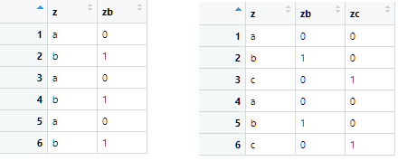

```{r include = FALSE}
knitr::opts_chunk$set(comment = "", message=F, warning=F)
library(ggplot2)
library(dplyr)
library(patchwork)
```


## Content

1. The linear model `lm()`

2. Simple regression
    
3. Multiple regression


## Linear Model

The linear regression model:

$$y_i=\beta_0+\sum_{j}\beta_{j} x_{ij}+\varepsilon_i, \ \ \ \ \ \  \varepsilon_i\sim N(0, \sigma^2)$$
where

- $y_i$ is score of individual $i$ on the numeric dependent variable $Y$

- $x_{ij}$ is the score of individual $i$ on predictor $X_j$  

- $\beta_0$ is the intercept 

- $\beta_j$ is the slope of $X_j$

- $\varepsilon_{i}$ is the residual (prediction error)


## The `lm()` function

```{r eval = FALSE}
lm(formula, data) # returns an object of class lm
```

formula        | model
:--------------|--------------------------
`y ~ 1`        | intercept-only
`y ~ x1`       | main effect of x1
`y ~ x1 + x2`  | main effects of x1, x2
`y ~ .`        | main effects of all predictors
`y ~ . - x1`   | main effects of all predictors except x1
`y ~ x1 + x2 + x1:x2`    | main effects + interaction between x1 and x2
`y ~ x1*x2`    | idem
`y ~ .^2`      | main effects + pairwise interactions between all predictors


# Simple regression 

## Continuous predictor


- observed = fitted + residual

$$y_i=\hat{y}_i+\varepsilon_i$$
- fitted = intercept + slope times x

$$\hat{y}_i=\beta_0 + \beta_1x_i$$

<br>

- fitted changes with $\beta_1$ for each unit increase in $x$

## Regression line for `mpg ~ disp`

```{r message = FALSE}
ggplot(mtcars, aes(disp, mpg)) + 
  geom_point() +
  xlim(0, 500) +
  geom_smooth(method = "lm", se = FALSE, fullrange=T)
```

## Coefficients

Interpretation the parameter estimates.

```{r}
(fit <- lm(mpg ~ disp, mtcars))
```

## Structure of `lm` object

```{r}
str(fit)
```

## Summary of `lm` object 

```{r}
summary(fit)
```

## Structure summary `lm` object

```{r}
str(summary(fit))
```


## Extracting  `lm` list elements:


Function / Subsetting        | Output
-----------------------------|-------------------------
`coef(fit) / fit$coef`       | coefficients
`fitted(fit) / fit$fitted`   | fitted values
`resid(fit) / fit$resid`     | residuals
`summary(fit)$r.squared`     | R-squared statistic

```{r collapse = T}
fit$coef
summary(fit)$r.squared
```


# Categorical predictor 


## Dummy variables

Categorical predictors are converted into dummy variables: 

- each category has a dummy with value 1 for that category, and 0 otherwise

- except for the reference category  (0 on all dummies)

- all categories are compared to the reference category


```{r echo = FALSE, out.width = "70%", fig.cap = "Reference category of $z$ is $a$", fig.align = "center"}

```


## Interpreting dummies

Model for categorical $Z$ with categories $a, b, c$:

$$\hat{y}=\beta_0+\beta_1zb+\beta_2zc$$

<br>

parameters        | interpretation
------------------|---------------
$\beta_0$         | predicted mean category $a$ (reference category)
$\beta_0+\beta_1$ | predicted mean category $b$
$\beta_0+\beta_2$ | predicted mean category $c$


## Example

Interpret the parameter estimates of model `mpg ~ factor(am)` 

- `am = 0` is  automatic and `am = 1` is manual transmission

- reference category is `am = 0`


```{r}
coef(lm(mpg ~ factor(am), mtcars))
```


## Regression line

```{r message = FALSE}
ggplot(mtcars, aes(am, mpg)) + 
  geom_point() +
  geom_smooth(method = "lm", se = FALSE)
```


## Predictor `gear` with 3 categories

Works the same as above, but one more dummy needed

- linear model with 2 dummies

- reference category `gear = 3`

```{r}
lm(mpg ~ factor(gear), mtcars)
```


## Regression lines


Two regression lines

- one from reference 3 gears to 4 gears

- one from reference 3 gears to 5 gears

```{r fig.asp = 0.4, echo=F}
mtcars %>% filter(gear != 5) %>%  
    ggplot(aes(gear, mpg)) + 
    geom_point() + 
    geom_smooth(method = "lm", se = F) + 
    scale_x_continuous(breaks = c(3, 4)) +
  
mtcars %>% filter(gear != 4) %>% 
    ggplot(aes(gear, mpg)) + 
    geom_point() + 
    geom_smooth(method = "lm", se = F) + 
    scale_x_continuous(breaks = c(3, 5))
```


## Factor or not?

The model `mpg ~ gear` interprets the number of gears as numeric

- only one slope is estimated

```{r fig.dim=c(4, 3), echo=F}
ggplot(mtcars, aes(gear, mpg)) + geom_point()+geom_smooth(method="lm", se=F) +  
    scale_x_continuous(breaks = 3:5)
```


## Model comparisons with `anova()`

Which model fits better: 

1. `mpg ~ gear`  

2. `mpg ~ factor(gear)`

<br>

Model 2 has one more parameter, so it is expected to fit better.

- But is it significantly better?

<br>

We can check this with an $F$-test for the $R^2$-change

- The function to do this test is `anova(model 1, model 2)`


## ANOVA

Compare the fit of the models:

- `mpg ~ 1`
- `mpg ~ gear`
- `mpg ~ factor(gear)`

```{r}
anova(lm(mpg ~ 1, mtcars),
      lm(mpg ~ gear, mtcars),
      lm(mpg ~ factor(gear), mtcars))
```


# Multiple regression


## Main-effects model

No interactions in the model, e.g.

$$\hat{y}=\beta_0+\beta_1x_1+\beta_2x_2$$
<br>

Interpretation

- the slope of $x_1$ does not depend on $x_2$, and vice versa

- the slopes of $x_1$ and $x_2$ are corrected for the correlation $r_{x_1,x_2}$


## Model with `disp` and `gear`

```{r results = "hold"}
lm(mpg ~ disp, mtcars)$coef %>% round(3)

lm(mpg ~ gear, mtcars)$coef %>% round(3)

lm(mpg ~ disp + gear, mtcars)$coef %>% round(3)
```

- The slope of `gear` almost disappeared in the last model.


## Interactions

The slope of one predictor depends on the value of the other

```{r}
lm(mpg ~ disp * factor(am), mtcars) 
```

- The slope of `disp` for `am = 0` is -0.2758

- The slope of `disp` for `am = 1` is -0.2758 - 0.03145 = -0.30725

## Visualization of the interaction model

There is obviously an interaction

```{r fig.height = 3, fig.width = 4, message=F}
ggplot(mtcars, aes(disp, mpg, col = factor(am))) + 
  geom_point() + 
  geom_smooth(method = "lm", se=F)
```


## Comparison coefficients

```{r echo=F}
full_join(
tibble::rownames_to_column(data.frame("main effects"=lm(mpg ~ disp + factor(am), mtcars)$coef)),
tibble::rownames_to_column(data.frame(interaction=lm(mpg ~ disp * factor(am), mtcars)$coef)))

```


## Compare the plots

- Main effects model: same slopes, different intercepts (not visible)

- Interaction model: different slopes and different intercepts

```{r echo = FALSE, message = FALSE, fig.asp = .4}
ggplot(mtcars, aes(disp, mpg, col = factor(gear))) + 
  geom_point() + 
  geom_line(aes(y = predict(lm(mpg ~ disp + factor(gear), mtcars))), linewidth = 1) +    
  ggtitle("main effects model") +

ggplot(mtcars, aes(disp, mpg, col = factor(gear))) +
  geom_point() +
  geom_smooth(method = "lm", se = F, fullrange = T) +
  ylim(c(10, 35)) +
  ggtitle("interaction model")
```


## ANOVA


Compare the fit of the main effects and interaction model


```{r}
anova(lm(mpg ~ disp + factor(gear), mtcars),
      lm(mpg ~ disp * factor(gear), mtcars))
```
