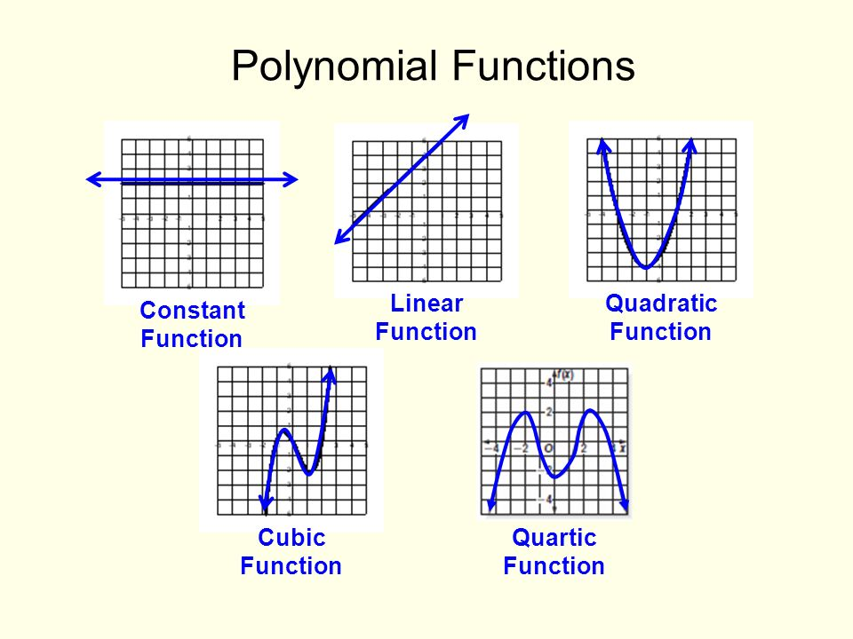
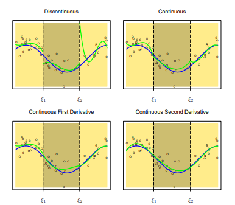
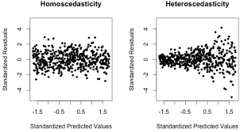

```{r include = FALSE}
knitr::opts_chunk$set(message = FALSE, comment = NA)
library(dplyr)
library(ggplot2)
library(patchwork)
library(splines)
```


## Content

1. Assumptions 

2. Residual plots

3. Resolving issues

    + non-linearity
    
    + heteroscedasticity
    
    + multicollinearity


## Assumptions

Assumptions of the linear model:

- linearity         

- normality

- homoscedasticity  

- no outliers


## Example

We will use the following model as an example.

```{r echo = FALSE}
lm(mpg ~ disp, mtcars)
```

```{r echo = FALSE, fig.align = "center", fig.width = 4, fig.height = 2.5}
ggplot(mtcars, aes(disp, mpg)) +
  geom_point() +
  geom_smooth(method = "lm", se = FALSE) +
  theme_minimal()
```


# Residual plots


## Plots generated by `lm`


Plot                | Assumption check
--------------------|----------------------------------
Residuals vs Fitted | Linearity
Scale-Location      | Homoscedasticity
Normal Q-Q          | Normality 
Residuals vs Leverage | Influential cases

The code is

```{r eval=F}
par(mfrow = c(2, 2))  # to have them in one figure
plot(<lm object>)
```


## 


```{r fig.asp = .8, echo = FALSE}
par(mfcol = c(2, 2), mar = c(4, 4, 1.5, 2))
plot(lm(mpg ~ disp, mtcars))
```


## Residuals vs Fitted

**Linearity**: straight red line at 0 

- Middle fitted values overestimate `mpg`

<br>

```{r echo = FALSE, fig.width = 4, fig.height = 3.5, fig.align = "center"}
par(mar = c(4, 4, 1.5, 2))
plot(lm(mpg ~ disp, mtcars), which = 1, 
     cex = .5, cex.lab = .8,  cex.axis = .8, cex.main=.8, 
     sub = "")
```


## Scale-Location

**Homoscedasticity**: straight red line

- Residual variance increases with fitted value 

<br>

```{r echo = FALSE, fig.width = 4, fig.height = 3.5, fig.align = "center"}
par(mar = c(4, 4, 1.5, 2))
plot(lm(mpg ~ disp, mtcars), which = 3, 
     cex = .5, cex.lab = .8,  cex.axis = .8, cex.main=.8, 
     sub = "")
```


## Q-Q residuals plot

**Normality**: points on diagonal

- Too many residuals in the tails

<br>

```{r echo = FALSE, fig.width = 4, fig.height = 3.5, fig.align = "center"}
par(mar = c(4, 4, 1.5, 2))
plot(lm(mpg ~ disp, mtcars), which = 2, 
     cex = .5, cex.lab = .8,  cex.axis = .8, cex.main=.8, 
     sub = "")
```


## Residuals vs Leverage

**Leverage**: values $>4n$ problematic ($4/32=1.125$)

- outlier on $X$

**Cook's distance** values $>1$ problematic

- outlier on $(X,y)$
<br>

```{r echo = FALSE, fig.width = 4, fig.height = 3.5, fig.align = "center"}
par(mar = c(4, 4, 1.5, 2))
plot(lm(mpg ~ disp, mtcars), which = 5, 
     cex = .5, cex.lab = .8,  cex.axis = .8, cex.main=.8, 
     sub = "")
```


# Non-linearity 


## Solutions to non-linearity

Model extensions 

- polynomials

- interactions  


## Polynomial models 

Model including power expansions (quadratic, cubic, quartic, etc.)

<br>

$$y=\beta_0+\beta_1x+\beta_2x^2+\beta_3x^3+\dots+\varepsilon$$
<br>

The more powers, the more flexible the regression line

```{r fig.align = "center", out.width = "40%", echo = FALSE}

```


## The `poly()` function

The function `poly(x, degree)` creates orthogonal polynomials

```{r collapse = TRUE}
(raw <- poly(1:4, degree = 2, simple = T, raw = T))
cor(raw)[1, 2]

(pol <- poly(1:4, degree = 2, simple = T))
cor(pol)[1, 2]

```


## Two-minute exercise{.build}

<div class="red">

Plot the raw and orthogonal 2nd degree polynomials of `disp`.

</div>

```{r  fig.asp = 0.5}
disp <- arrange(mtcars, disp) %>% select(disp) %>% unlist()

par(mfrow=c(1,2))
plot(poly(disp, 2, raw = T), type="l")
plot(poly(disp, 2, raw = F), type="l")
```


## Quadratic model 

```{r}
summary(lm(mpg ~ poly(disp, 2), mtcars))
```


## Quadratic vs cubic model

```{r fig.width = 4, fig.height = 3, fig.align = "center"}
ggplot(mtcars, aes(disp, mpg)) +
  geom_point() +
  geom_smooth(method = "lm", se = FALSE, formula = y ~ poly(x, 2)) +
  geom_smooth(method = "lm", se = FALSE, formula = y ~ poly(x, 3), col = "red") +
  theme_minimal() +
  ggtitle("Model with quadratic and cubic polynomial")
```


## Model selection

Comparison linear, quadratic, cubic and quartic models
```{r}
anova(lm(mpg ~ disp, mtcars),
      lm(mpg ~ poly(disp, 2), mtcars),
      lm(mpg ~ poly(disp, 3), mtcars),
      lm(mpg ~ poly(disp, 4), mtcars))
```


## Residual plots cubic model

```{r fig.asp = .7, echo = FALSE}
par(mfcol = c(2, 2), mar = c(4, 4, 1.5, 2))
plot(lm(mpg ~ poly(disp, 3), mtcars))
```

## Leverage plot

Data points with leverage $>.125$ are highly influential

- indication of overfitting

```{r echo = FALSE, fig.width = 4, fig.height = 4, fig.align = "center"}
plot(lm(mpg ~ poly(disp, 3), mtcars), which = 5, 
     cex = .5, cex.lab = .8,  cex.axis = .8, cex.main=.8, 
     sub = "")
```


## Splines

Cubic polynomials within regions of $X$ (boundaries $\xi$ are called *knots*)




## Fitting splines

Splines can be fitted with the function `bs()` from the package `splines`.

- `df` to specify the number of (evenly spaced) knots minus 3
- `knots` to specify the position of the knots 

```{r fig.asp = .35}
ggplot(mtcars, aes(disp, mpg)) + geom_point() +
  geom_smooth(method = "lm", se = F, formula = y ~ bs(x, df = 4)) +
ggplot(mtcars, aes(disp, mpg)) + geom_point() +
  geom_smooth(method = "lm", se = F, formula = y ~ bs(x, knots = 350)) 
```


# Interaction models

## Interpretation slopes

Slope of $x_1$ varies with values of $x_2$ and vice-versa

$$y=\beta_0+\beta_1x_1+\beta_2x_2+\beta_{12}x_1x_2+\varepsilon$$

<br>

Example: adding `factor(gear)` to the model

```{r echo = FALSE}
anova(lm(mpg ~ disp, mtcars),
      lm(mpg ~ disp + gear, mtcars),
      lm(mpg ~ disp * gear, mtcars))
```


## Add `gear` as predictor

Effect of `gear` as a `factor`.

- no significant main effects of `gear` (no difference in intercepts)

- highly significant interaction effect (clear difference in slopes)

<br>

```{r echo = FALSE, fig.asp = 0.35}
m <- lm(mpg ~ disp + factor(gear), mtcars)$fitted
ggplot(mtcars, aes(disp, mpg, col = factor(gear))) +
    geom_point() +
    geom_line(aes(y = m), linewidth = 1) + 
    theme_minimal() + 
    ggtitle("main effects model") +
ggplot(mtcars, aes(disp, mpg, col = factor(gear))) +
    geom_point() +
    geom_smooth(method = "lm", se = FALSE) + 
    theme_minimal()+ ggtitle("interaction model") + plot_layout(guides = "collect")
```


## Residual plots


```{r fig.asp = 0.7, echo = FALSE}
par(mfcol = c(2, 2), mar = c(4, 4, 1.5, 2))
plot(lm(mpg ~ disp * factor(gear), mtcars))
```


# Heteroscedasticity


## What is heteroscedasticity?

Variance of the residuals is correlated with the fitted values.

- variables are skewed

- error variance correlates with the fitted values

- standard errors and $p$-values are biased

<br>

```{r echo = FALSE, out.width = "60%", fig.align = "center"}

```


## Resolving heteroscedasticity

Data transformation may solve the problem

- `log` or `sqrt` transformation for variables with right skew 
     
```{r fig.asp = 0.5, echo = FALSE}
par(mfrow = c(1, 3))
with(mtcars, boxplot(disp, xlab = "disp"))
with(mtcars, boxplot(sqrt(disp), xlab = "sqrt(disp)"))
with(mtcars, boxplot(log(disp), xlab = "log(disp)"))
```


## Improving linearity

Scatter plots after transformation of `disp`

```{r echo = FALSE, fig.asp = 0.4}
  ggplot(mtcars, aes(disp, mpg)) +
    geom_point() + geom_smooth(se = F) + geom_smooth(method = "lm", se = F, col = "red") +
    theme_minimal() +
    ggtitle("mpg ~ disp") +
  ggplot(mtcars, aes(log(disp), mpg)) +
    geom_point() +  geom_smooth(se = F) + geom_smooth(method = "lm", se = F, col = "red") +
    theme_minimal() +
    ggtitle('mpg ~ log(disp)') +
  ggplot(mtcars, aes(sqrt(disp), mpg)) +
    geom_point() +  geom_smooth(se = F) + geom_smooth(method = "lm", se = F, col = "red") +
    theme_minimal()+
    ggtitle("mpg ~ sqrt(mpg)") 
```


# Multicollinearity


## Detecting multicollinearity

Multicollinearity 

- highly correlated (combinations of) predictors 

- unreliable parameter estimates and inflated standard errors

<br>

Detected with VIF (Variance Inflation Factor) 

- VIF = 1 no multicollinearity whatsoever

- VIF > 10 serious multicollinearity

<br>

Resolving multicollinearity

- drop or merge predictors

- standardize interacting predictors


## VIF examples

- Too many predictors

```{r echo=F}
DAAG::vif(lm(mpg ~ ., mtcars))
```

- Cubic model with correlated polynomials
```{r echo=F}
DAAG::vif(lm(mpg ~ disp + I(disp^2) + I(disp^3), mtcars))
```

- Cubic model with orthogonal polynomials

```{r echo=F}
DAAG::vif(lm(mpg ~ poly(disp, 3), mtcars))
```

- Interaction model

```{r echo=F}
DAAG::vif(lm(mpg ~ disp * factor(gear), mtcars))
```


## Two-minute exercise

<div class="red">
1. For all predictors in model `mpg ~ .`, test if $p<.05$ (return TRUE/FALSE)

2. Display the VIFs of `mpg ~ poly(disp, 3)` (orthogonal polynomials)

3. Display the VIFs of `mpg ~ scale(disp) * scale(hp)`
</div>


```{r comment = ""}
summary(lm(mpg~., mtcars))$coef[, 4] < .05
DAAG::vif(lm(mpg ~ poly(disp, 3), mtcars))
DAAG::vif(lm(mpg ~ scale(disp) * scale(hp), mtcars))
```


# Lab time
