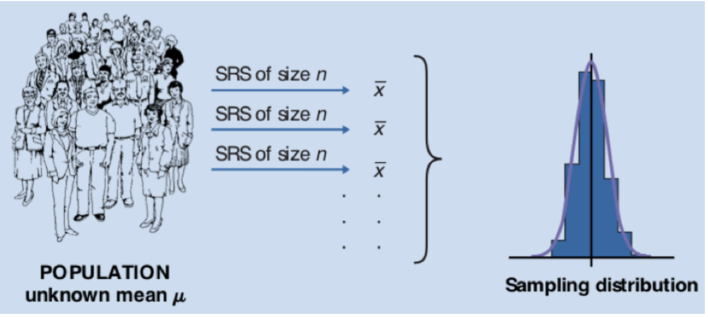
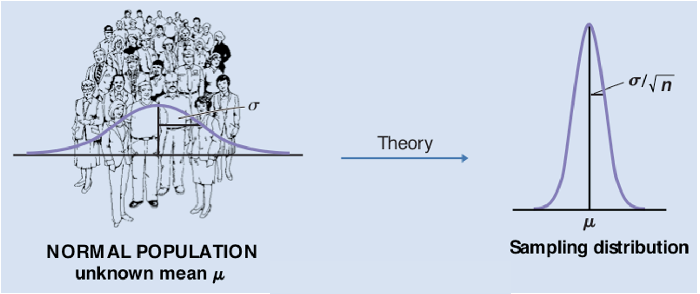
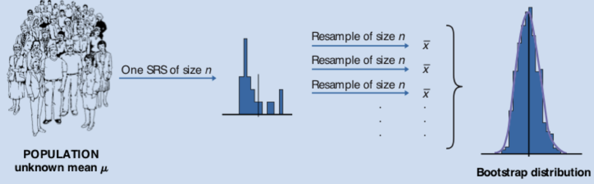
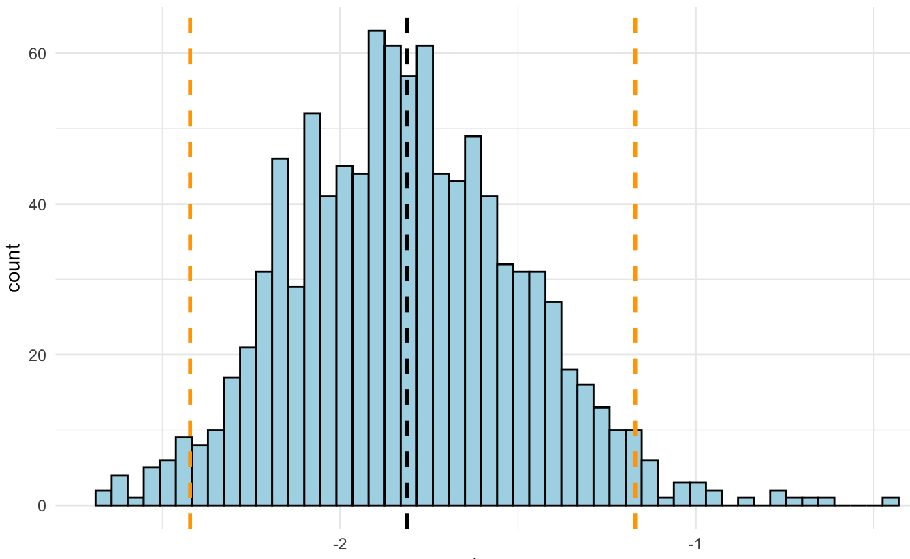

```{r global_opts, include=FALSE}
knitr::opts_chunk$set(message = FALSE, 
                      warning = FALSE, 
                      fig.width = 16/2,
                      fig.height = 9/2,
                      comment = "")
```


```{r Load_packages, include=FALSE}
# Ensures the package "pacman" is installed
if (!require("pacman")) install.packages("pacman")

pacman::p_load(tidyverse,
               ggplot2,
               gtsummary,
               patchwork,
               GGally,
               boot)

# Load mammals sleep data
load("MammalsSleepData.RData")
```


## Topics of this lecture

* A review of statistical inference concepts
  + Parameters and statistics
  + Hypothesis testing, confidence intervals


* Resampling
  + Bootstrap
  + Program bootstrap function
  

# A review of inference concepts

## Parameters and statistics

**Random sample**

- set of values drawn independently from a population

**Population parameter** 

- Property of the population (e.g. $\mu,\sigma,\rho$) 

**Sample statistic** 

- Property of the sample (e.g. $\bar{x},s,r$) 

**Standard error**

- Variability of a sample statistic

## Sampling distribution

The sampling distribution is the distribution of a sample statistic (e.g. mean, standard deviation)

Take many random samples from population and compute mean -> **sampling distribution** of the mean

<br>

{width=70%}


## Central Limit Theorem

- **Given a distribution with mean $\mu$ and standard deviation $\sigma$, the sampling 
distribution of the mean approaches a normal distribution with mean $\mu$ and standard deviation $\frac{\sigma}{\sqrt{n}}$ as $n\to\infty$ **

Conditions for the CLT to hold

- $\mu$ and $\sigma$ known
- the sample size $n$ is sufficiently large

{width=70%}


## Hypothesis test, confidence interval
Using the properties of the normal distribution (95% of the observations are within approximately 2 standard deviations around the mean $\bar{x}$), we compute a 95% confidence interval with the sampling statistics: 

$\bar{x} \pm 1.96 \cdot \text{SE}$, where $\text{SE} = s / \sqrt{n}$

<br>

```{r echo=F, fig.width = 12/2, fig.height = 7/2}

# Create a sequence of x values
x <- seq(-4, 4, length = 1000)

# Calculate the normal distribution values
y <- dnorm(x)

# Create the data frame
data <- data.frame(x, y)

# Define the limits for the 95% confidence interval
lower_limit <- -1.96
upper_limit <- 1.96

# Create the plot
p <- ggplot(data, aes(x, y)) + 
  geom_line(color = "blue") +
  geom_area(data = subset(data, x >= lower_limit & x <= upper_limit), aes(x = x, y = y), fill = "blue", alpha = 0.2) +
  geom_vline(xintercept = lower_limit, linetype = "dashed", color = "red") +
  geom_vline(xintercept = upper_limit, linetype = "dashed", color = "red") +
  labs(title = "95% confidence limits",
       x = "z",
       y = " ") +
  theme_minimal()

# Print the plot
print(p)
```

# Bootstrap

## When to use the Bootstrap

* If classical inference theory fails (assumptions are violated), statistical inference is still possible using resampling techniques to obtain standard errors, confidence intervals, and test hypotheses (example: median)

* Use the bootstrap to obtain the sampling distribution for a statistic.

* Use the bootstrap distribution to obtain standard errors and 95% confidence intervals. 

## Basic idea bootstrap resampling

{width=80%}


When there is **only one sample** and theory fails:

* The sample stands for the population
* The **bootstrap distribution** stands for sampling distribution 
* Substitute computing power for theoretical analysis

## The bootstrap: a resampling technique

Baron Münchausen has fallen in a lake and pulls himself and his horse up by his bootstrap (or hair, depending on the version).

{width=25%}
Rudolph Erich Raspe, Münchausen (1763)


## How to bootstrap?

1. Take a sample of size *n* with replacement from the sample (size *n*) 
2. Fit the model and save the statistic(s) of interest (e.g. $\bar{x}$) 
3. Use a loop to repeat sampling *B* times (*B* = 1000)
4. The *B* values of $\bar{x}$ form the bootstrap distribution

<br>

{width=80%}

## Bootstrap distribution 

{width=50%}

* Bootstrap distribution of 1000 regression coefficients approximates sampling distribution

* Standard deviation of the bootstrap distribution approximates the standard error

* 95% confidence interval limits: 2.5 and 97.5 percentiles


## Example with mammals sleep data

```{r}
subset_mammals <- mammals %>% 
  select(total_sleep, brain_wt, danger) %>%
  na.omit()

summary(subset_mammals)
```

## Exploring the data

```{r echo=F}
subset_mammals %>% 
  ggpairs(
  lower = list(continuous = wrap("smooth", color = "lightblue")),
  diag = list(continuous = wrap("barDiag", fill = "darkblue")),
  upper = list(continuous = wrap("cor", size = 4))
  ) +
  labs(
    title = "Pairwise correlations and distributions of mammals sleep data",
  ) +
  theme_minimal()
```

Doubts about normality: skewed distributions of `brain_wt`, variable `danger` with 5 levels.

## Linear regression 

Fit a linear regression with `total_sleep` as outcome variable and `brain_wt` and `danger` as predictor variables.

```{r}
fit_mammals <- lm(total_sleep ~ brain_wt + danger, data = subset_mammals)
summary(fit_mammals)
```


## 95\% Confidence Interval

Obtain 95% confidence intervals (theoretical):

```{r}
(CI95  <- confint(fit_mammals)) %>% round(digits=3)
```

# Program bootstrap function

## First draft of the function

Obtain bootstrap distribution for regression coefficient of `brain_wt`

1. Take a sample of size *n=62* **with replacement** from the original sample (size *n=62*) of mammals sleep data 
  
2. Fit the model and save the parameter estimates (regression coefficients)

```{r}
bootsample <- dplyr::slice_sample(subset_mammals, n = nrow(subset_mammals), replace = TRUE)

bootfit    <- lm(total_sleep ~ brain_wt, data = bootsample)

bootpars   <- bootfit$coef
```


## Container objects

To save statistics for multiple bootstrap samples, e.g.

- for 3 bootstrap samples

```{r}
output  <- matrix(nrow = 3, ncol = 2, 
                  dimnames = list(NULL, c("(Intercept)", "brain_wt")))

output
```


## Looping

To save parameters of each loop, make a container object:

```{r}
for (i in 1:3) {
  
  bootsample  <- dplyr::slice_sample(subset_mammals, n = nrow(subset_mammals), replace = TRUE)

  bootfit     <- lm(total_sleep ~ brain_wt, bootsample)
  
  output[i, ] <- bootfit$coef
}

output
```


## Bootstrap function

Include argument `B` for number of bootstrap samples (with default 500)


```{r}
bootstrap <- function(B = 500) {  
  
output  <- matrix(nrow = 3, ncol = 2, 
                  dimnames = list(NULL, c("(Intercept)", "brain_wt")))
  
  for (i in 1:B) {
    
    bootsample  <- dplyr::slice_sample(.data = data, n = nrow(data), replace = TRUE)
    
    bootfit     <- lm(formula = total_sleep ~ brain_wt, data = bootsample)
    
    output[i, ] <- bootfit$coef
  }
  
  return(output)
}
```

## General bootstrap function

Include the arguments `formula` and `data`

- extract the parameter names from `lm` object to use in `output`

```{r}
bootstrap <- function(formula, data, B = 1000) {  
  
  pars    <- lm(formula = formula, data = data) %>% coef() %>% names()
  
  output  <- matrix(nrow = B, ncol = length(pars),           
                    dimnames = list(NULL, pars))                 
  
  for (i in 1:B) {
    bootsample  <- dplyr::slice_sample(.data = data, n = nrow(data), replace = TRUE)
    bootfit     <- lm(formula = formula, data = bootsample)
    output[i, ] <- bootfit$coef
  }
  
  return(output)
}
```

## Test the bootstrap function

Bootstrapping the parameters of the linear regression model 15 times.

Set a random number seed to make the results reproducible.

```{r}
set.seed(848)
(boot_mammals <- bootstrap(total_sleep ~ brain_wt + danger, subset_mammals, 15) %>% round(3))
```

```{r echo=FALSE}
# Run linear regression model to obtain theoretical confidence intervals later
fit_mammals <- lm(formula = total_sleep ~ brain_wt + danger, data = subset_mammals)
```

# Obtain results with bootstrap function

## Run the bootstrap function for *B* = 1000 samples

Run the bootstrap function on the mammals sleep data with outcome variable total sleep and predictors brain weight and exposure to danger. Store the results.

```{r}
set.seed(848)
boot_mammals <- bootstrap(total_sleep ~ brain_wt + danger, subset_mammals)
```

## Plot bootstrap distributions

```{r echo=F}
# make dataframe from bootstrap parameters
df_boot_mammals <- data.frame(boot_mammals)

# Obtain bootstrap statistics from bootstrap distributions
bootstats <- df_boot_mammals %>% 
  summarize(bmean_brainwt = mean(brain_wt),
            bmean_danger = mean(danger),
            bsd_brainwt = sd(brain_wt),
            bsd_danger = sd(danger),
            lower_ci_brainwt = bmean_brainwt - (1.96 * bsd_brainwt),
            upper_ci_brainwt = bmean_brainwt + (1.96 * bsd_brainwt),
            lower_ci_danger = bmean_danger - (1.96 * bsd_danger),
            upper_ci_danger = bmean_danger + (1.96 * bsd_danger),
            q_lowerci_brainwt = quantile(bmean_brainwt, 0.025), 
            q_upper_ci_brainwt = quantile(bmean_brainwt, 0.975),
            q_lowerci_danger = quantile(bmean_danger, 0.025), 
            q_upper_ci_danger = quantile(bmean_danger, 0.975)
            )

# Plot bootstrap distribution of the two predictor variables

df_boot_mammals %>%
  ggplot(aes(brain_wt)) + 
  geom_histogram(bins = 50, fill = "lightblue", color = "black") +
  geom_vline(xintercept = fit_mammals$coefficients[[2]], col = "black", linetype = "dashed", linewidth = 2) +
  geom_vline(xintercept = bootstats$bmean_brainwt, col = "red", linewidth = 1) +
  theme_minimal() +
  labs(
    title = "Distribution bootstrapped regression coefficients brain weight and danger",
    subtitle = "Red= bootstrap mean, black = regression coefficient") +
  
df_boot_mammals %>%
  ggplot(aes(danger)) + 
  geom_histogram(bins = 50, fill = "lightblue", color = "black") +
  geom_vline(xintercept = fit_mammals$coefficients[[3]], col = "black", linetype = "dashed", linewidth = 2) +
  geom_vline(xintercept = bootstats$bmean_danger, col = "red", linewidth = 1) +
  theme_minimal()


```

```{r echo=F, eval=F}
df_boot_mammals %>%
  ggplot(aes(danger)) + 
  geom_histogram(bins = 50, fill = "lightblue", color = "black") +
  geom_vline(xintercept = bootstats$bmean_danger, col = "black", linetype = "dashed", linewidth = 1) + 
  geom_vline(xintercept = CI95_boot[3,1], col = "orange", linewidth = 1, linetype = "dashed") +
  geom_vline(xintercept = CI95_boot[3,2], col = "orange", linewidth = 1, linetype = "dashed") +
  theme_minimal()
```


## Bootstrap and theoretical 95% CI

Obtain bootstrap 95% percentile confidence intervals (empirical):
```{r }
(CI95_boot <- apply(boot_mammals, 2, function(x) quantile(x, probs = c(.025, .975))) %>% round(3))
```

Theoretical 95% confidence intervals (based on mathematical theory, $t$-distribution):

```{r echo=F}
fit_mammals <- lm(formula = total_sleep ~ brain_wt + danger, data = subset_mammals)
```


```{r}
(CI95  <- confint(fit_mammals) %>% round(3) %>% t())
```


## Compare confidence intervals

Compare confidence intervals:
```{r}
(CI95_boot  - (CI95) %>% round(2))
```


```{r echo=F}
CI95_boot <- apply(boot_mammals, 2, function(x) quantile(x, probs = c(.025, .975))) %>% 
  t() %>% 
  round(3)

fit_mammals <- lm(formula = total_sleep ~ brain_wt + danger, data = subset_mammals)

CI95  <- confint(fit_mammals)


bootstats <- df_boot_mammals %>% 
  summarize(bmean_brainwt = mean(brain_wt),
            bmean_danger = mean(danger),
            bsd_brainwt = sd(brain_wt),
            bsd_danger = sd(danger),
            lower_ci_brainwt = bmean_brainwt - (1.96 * bsd_brainwt),
            upper_ci_brainwt = bmean_brainwt + (1.96 * bsd_brainwt),
            lower_ci_danger = bmean_danger - (1.96 * bsd_danger),
            upper_ci_danger = bmean_danger + (1.96 * bsd_danger),
            q_lowerci_brainwt = quantile(bmean_brainwt, 0.025), 
            q_upper_ci_brainwt = quantile(bmean_brainwt, 0.975),
            q_lowerci_danger = quantile(bmean_danger, 0.025), 
            q_upper_ci_danger = quantile(bmean_danger, 0.975)
            )

```


## Compare theoretical and bootstrap 95% CI

```{r echo=F}
df_boot_mammals %>%
  ggplot(aes(brain_wt)) + 
  geom_histogram(bins = 60, fill = "lightblue", color = "black") +
  #geom_density(col = "darkblue") +
  geom_vline(xintercept = fit_mammals$coefficients[[2]], col = "darkblue", linewidth = 2) +
  geom_vline(xintercept = bootstats$bmean_brainwt, col = "orange", linewidth = 1) +
  geom_vline(xintercept = CI95_boot[2,1], col = "orange", linewidth = 1, linetype = "dashed") +
  geom_vline(xintercept = CI95_boot[2,2], col = "orange", linewidth = 1, linetype = "dashed") +
  geom_vline(xintercept = CI95[2,1], col = "darkblue", linewidth = 1, linetype = "dashed") +
  geom_vline(xintercept = CI95[2,2], col = "darkblue", linewidth = 1, linetype = "dashed") +
  theme_minimal() +
  labs(
    title = "Distribution bootstrapped regression coefficients brain weight and danger",
    subtitle = "Orange= bootstrap mean and 95%CI , dark blue = theoretical estimate and 95%CI") +
  
df_boot_mammals %>%
  ggplot(aes(danger)) + 
  geom_histogram(bins = 60, fill = "lightblue", color = "black") +
  #geom_density(col = "darkblue") +
   geom_vline(xintercept = fit_mammals$coefficients[[3]], col = "darkblue", linewidth = 2) +
  geom_vline(xintercept = bootstats$bmean_danger, col = "orange", linewidth = 1) +
  geom_vline(xintercept = CI95_boot[3,1], col = "orange", linewidth = 1, linetype = "dashed") +
  geom_vline(xintercept = CI95_boot[3,2], col = "orange", linewidth = 1, linetype = "dashed") +
  geom_vline(xintercept = CI95[3,1], col = "darkblue", linewidth = 1, linetype = "dashed") +
  geom_vline(xintercept = CI95[3,2], col = "darkblue", linewidth = 1, linetype = "dashed") +
  theme_minimal()
```


# Sourcing

## Source file

If you have written an function:

1. Save it in an R script, e.g. "my_bootstrap.R"

2. Make the function available by sourcing the script, e.g.

    - in your Rmd file, include the R chunk


```{r eval=F}
source("my_bootstrap.R")    
```

## Bootstrap: recommendations

Use the bootstrap when you suspect that assumptions are violated, of when there are not theoretical estimates possible.

The bootstrap does not solve the problem of violated assumptions: the bootstrap cannot be used to obtain better estimates.

The bootstrap confidence interval compared to theoretical interval will give insight in how violations of assumptions might influence the results. 


# Lab

## Lab 4b

* Download the files of Lecture and Lab 4b


