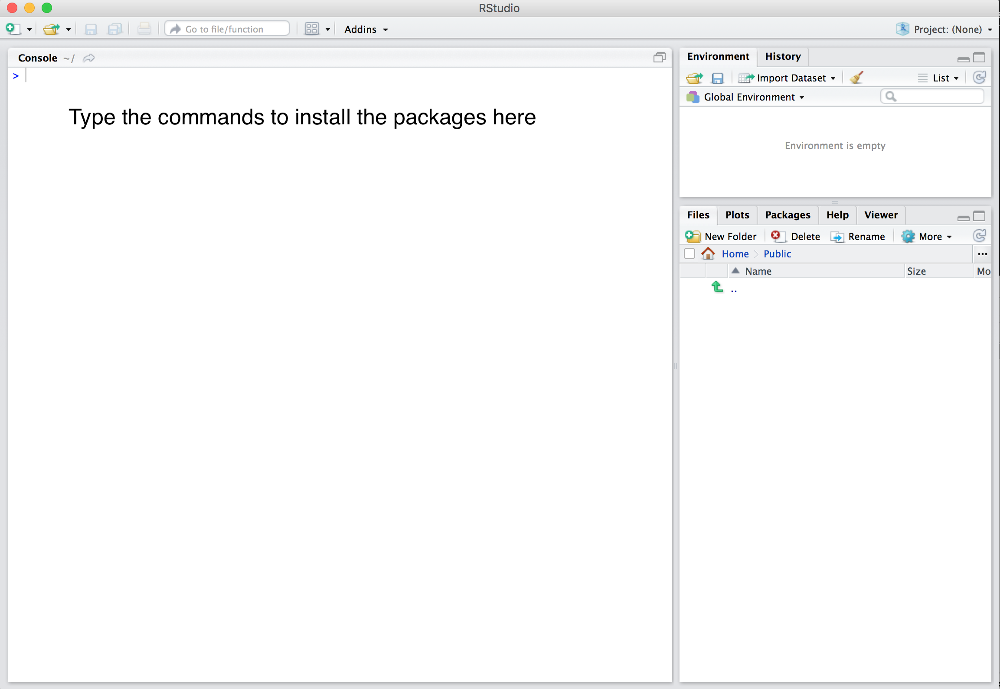

<br>

## Preparing your laptop 

To be able to participate in this course, you have to prepare your
laptop in the following way:

## System requirements

Bring a laptop computer to the course and make sure that you have full write access and administrator rights to the machine. We will explore programming in this course. This means that you need full access to your machine. Some corporate laptops come with limited access for their users, we therefore advice you to bring a personal laptop computer, if you have one. 

### 1. Install the latest version of `R`

`R` can be downloaded [here](https://cran.r-project.org).

### 2. Install the latest version of `RStudio` Desktop

`Rstudio` can be downloaded [here](https://www.rstudio.com/products/rstudio/download/#download).

*Please note that:*

-   It is important to ***install `R` first*** and then
    `RStudio Desktop`.
-   The free and open source `RStudio Desktop` version is sufficient for
    this course.

### 3. Install packages

Start `RStudio` and install the following packages by copy and paste these 
exact commands in the console pane:

<br>

```{r eval=FALSE, echo = TRUE}
install.packages(c("tidyverse", "knitr", "rmarkdown", "rmdformats", "prettydoc", 
                   "rticles", "hrbrthemes", "plotly", "patchwork", "shiny", 
                   "devtools", "boot", "gtsummary", "papaja", "car", "DAAG", 
                   "splines", "mice", "broom","janitor", "pacman", "gapminder",
                   "kableExtra"), dependencies = TRUE)
```

<br>

If you are not sure where to execute code, use the following figure to identify the console:

<br>

{width=80%}
<br><br>

Just copy and paste the code in the console window and press the return key. When asked the question below, type `Yes` in the console and press the return key.

<br>

```{r eval = FALSE, echo = TRUE}
Do you want to install from sources the package which needs 
compilation? (Yes/no/cancel)
```


<br>


